|  |
| --- |
| HỌC VIỆN CÔNG NGHỆ BƯU CHÍNH VIỄN THÔNG   **KHOA CÔNG NGHỆ THÔNG TIN**      BÁO CÁO BÀI TẬP LỚN   **NHẬP MÔN CÔNG NGHỆ PHẦN MỀM**   Chủ đề: **QUẢN LÝ QUÁN CÀ PHÊ**   Giảng viên hướng dẫn: **Đỗ Thị Liên**   Lớp: **D23CQCE01-B**   Nhóm thực hiện: 8Phạm Thị Thiên Hà B23DCCN266 Nguyễn Mai Quỳnh B23DCAT256 Phan Dạ Thi B23DCCN780 Hồ Trọng Bách B23DCVT041 Nguyễn Thành Long B23DCVT257 |
| **Hà Nội, 2026** |

# LỜI MỞ ĐẦU

Trong suốt quá trình học tập và thực hiện bài tập lớn môn Công nghệ phần mềm, nhóm chúng em xin gửi lời cảm ơn chân thành và sâu sắc nhất đến cô Đỗ Thị Liên. Những bài giảng tâm huyết, sự hướng dẫn tận tình và những góp ý quý báu của cô đã giúp chúng em củng cố kiến thức lý thuyết về quy trình xây dựng phần mềm, cũng như nắm bắt được các công nghệ và công cụ thực tế để hoàn thiện đề tài này.

Chúng em cũng xin gửi lời cảm ơn đến Ban Giám đốc Học viện Công nghệ Bưu chính Viễn thông và các thầy cô khoa Công nghệ Thông tin đã tạo môi trường học tập tốt nhất, trang bị cho chúng em những nền tảng kiến thức vững chắc về Công nghệ phần mềm và các công cụ phát triển hệ thống.

Mặc dù đã rất cố gắng hoàn thiện hệ thống, nhưng do giới hạn về mặt thời gian và kinh nghiệm thực tiễn, đề tài của chúng em chắc chắn không tránh khỏi những thiếu sót. Chúng em rất mong nhận được sự nhận xét, đánh giá và góp ý từ cô để hệ thống được hoàn thiện hơn, cũng như giúp chúng em rút ra những bài học quý giá cho các dự án sau này.

Chúng em xin chân thành cảm ơn!

**Hà Nội, tháng 5 năm 2026**

**Nhóm sinh viên thực hiện**

# DANH MỤC CÁC KÝ HIỆU VÀ CHỮ VIẾT TẮT

# DANH MỤC BẢNG

# DANH MỤC HÌNH ẢNH

# MỤC LỤC

Phần 1. Pha xác định yêu cầu (71-86) 2

1\. Bảng thuật ngữ (Bách) 3

2\. Mô tả hệ thống (bằng ngôn ngữ tự nhiên) (Long) 7

3\. Xây dựng sơ đồ use case tổng quan (Quỳnh) 12

4\. Phân rã chi tiết các use case (Làm theo phần được giao) 14

Phần 2. Pha phân tích (102-116) 21

1\. Các kịch bản (Làm theo phần được giao) 22

1\. Trích các lớp thực thể (Thi) 28

2\. Phân tích chi tiết từng module (Làm theo use case được giao) 29

Phần 3. Pha thiết kế (131-147) 32

1\. Thiết kế lớp thực thể (Hà) 33

2\. Thiết kế cơ sở dữ liệu (Hà) 33

3\. Thiết kế chi tiết các module (Làm theo phần được giao) 33

# Phần 1. Pha xác định yêu cầu (71-86)

## Bảng thuật ngữ (Bách)

***Danh sách các từ khóa liên quan đến lĩnh vực quản lý quán cà phê***

| Sản phẩm |  | Client đăng nhập | Client | Admin đăng nhập |
| --- | --- | --- | --- | --- |
| Danh mục |  | Client đăng ký | Admin | Quản lý sản phẩm |
| Giỏ hàng |  | Đặt đơn hàng | Extension Point | Thêm/Chỉnh sửa/Xoá sản phẩm |
| Đơn hàng |  | Xác nhận món từ giỏ | Include | Khoá sản phẩm |
| Thống kê |  | Điền địa chỉ nhận hàng | Extend | Tìm sản phẩm theo tên/ID |
| Kho sản phẩm |  | Tuỳ chọn thông tin đặt hàng |  | Quản lý danh mục |
|  |  | Tuỳ chọn tên người nhận |  | Thêm/Chỉnh sửa/Xoá danh mục |
|  |  | Tuỳ chọn ghi chú |  | Tìm danh mục theo tên/ID |
|  |  | Tuỳ chọn sđt |  | Quản lý đơn hàng |
|  |  | Theo dõi đơn hàng |  | Huỷ đơn |
|  |  | Huỷ đơn hàng |  | Cập nhật trạng thái đơn |
|  | Tìm chọn đơn hàng |  | Xem chi tiết đơn |  |
|  | Quản lý giỏ hàng |  | Tìm đơn theo tên/sđt/ID |  |
|  | Thêm/Bỏ đồ khỏi giỏ |  | Xem thống kê |  |
|  | Tìm chọn đồ |  | Thống kê theo món/thời gian |  |
|  | Cài đặt tuỳ chọn |  |  |  |
|  | Chọn số lượng/size |  |  |  |
|  | Chọn mức đá/đường |  |  |  |
|  | Thêm ghi chú |  |  |  |

***Giải thích nghĩa của các thuật ngữ trong ngữ cảnh của ứng dụng quản lý quán cà phê:***

| **TT** | **Tên Tiếng Việt** | **Tên Tiếng Anh** | **Ngữ nghĩa** |
| --- | --- | --- | --- |
| **_Nhóm thuật ngữ liên quan đến quán cà phê_** |  |  |  |
| 1 | Quán cà phê | Cafe | Hệ thống quản lý kinh doanh đồ uống và dịch vụ |
| 2 | Sản phẩm | Product | Các loại đồ uống, món ăn được bán trong quán |
| 3 | Danh mục | Category | Nhóm phân loại sản phẩm (cà phê, trà, sinh tố...) |
| 4 | Giỏ hàng | Cart | Nơi lưu trữ tạm thời các món khách chọn trước khi đặt |
| 5 | Kho sản phẩm | Product Inventory | Danh sách sản phẩm hiện có trong hệ thống |
| 6 | Đơn hàng | Order | Yêu cầu mua hàng của khách được ghi nhận trong hệ thống |
| 7 | Thống kê | Statistics | Dữ liệu tổng hợp về doanh thu, sản phẩm bán chạy... |
| **_Nhóm thuật ngữ liên quan đến hoạt động của khách hàng_** |  |  |  |
| 1 | Client đăng nhập | Client Login | Khách hàng xác thực tài khoản để truy cập hệ thống |
| 2 | Client đăng ký | Client Register | Khách hàng tạo tài khoản mới trên hệ thống |
| 3 | Đặt đơn hàng | Place Order | Khách hàng gửi yêu cầu mua sản phẩm |
| 4 | Xác nhận món từ giỏ hàng | Confirm Cart Items | Khách hàng kiểm tra và xác nhận các món đã chọn |
| 5 | Điền địa chỉ nhận hàng | Fill Delivery Address | Khách hàng cung cấp thông tin địa chỉ giao hàng |
| 6 | Tuỳ chọn thông tin đặt hàng | Customize Order Info | Khách hàng điều chỉnh thông tin người nhận, ghi chú |
| 7 | Tuỳ chọn tên người nhận | Customize Recipient Name | Khách hàng nhập tên người nhận hàng |
| 8 | Tuỳ chọn ghi chú | Customize Notes | Khách hàng thêm ghi chú đặc biệt cho đơn hàng |
| 9 | Tuỳ chọn sđt | Customize Phone | Khách hàng nhập số điện thoại liên hệ |
| 10 | Theo dõi đơn hàng | Track Order | Khách hàng kiểm tra trạng thái đơn hàng của mình |
| 11 | Huỷ đơn hàng | Cancel Order | Khách hàng hủy đơn đã đặt |
| 12 | Tìm chọn đơn hàng | Find/Select Order | Khách hàng tìm kiếm đơn hàng cụ thể |
| 13 | Quản lý giỏ hàng | Manage Cart | Khách hàng thêm/xóa/sửa món trong giỏ |
| 14 | Thêm đồ vào giỏ | Add to Cart | Khách hàng thêm sản phẩm vào giỏ hàng |
| 15 | Bỏ đồ khỏi giỏ | Remove from Cart | Khách hàng xóa sản phẩm khỏi giỏ hàng |
| 16 | Tìm chọn đồ | Find/Select Items | Khách hàng tìm kiếm sản phẩm để mua |
| 17 | Cài đặt tuỳ chọn | Customize Settings | Khách hàng tùy chỉnh thông số sản phẩm |
| 18 | Chọn số lượng | Select Quantity | Khách hàng chọn số lượng sản phẩm |
| 19 | Chọn size | Select Size | Khách hàng chọn kích cỡ đồ uống |
| 20 | Chọn mức đá | Select Ice Level | Khách hàng chọn lượng đá (ít đá, nhiều đá...) |
| 21 | Chọn mức đường | Select Sugar Level | Khách hàng chọn độ ngọt (ít đường, không đường...) |
| 22 | Thêm ghi chú | Add Notes | Khách hàng thêm yêu cầu đặc biệt cho món |
| **_Nhóm thuật ngữ liên quan đến người dùng_** |  |  |  |
| 1 | Client | Client | Khách hàng - người sử dụng dịch vụ đặt hàng |
| 2 | Admin | Admin | Quản trị viên - người quản lý hệ thống |
| 3 | Extension Point | Extension Point | Điểm mở rộng cho phép thêm chức năng tùy chọn |
| 4 | Include | Include | Quan hệ bao gồm - use case này bắt buộc gọi use case kia |
| 5 | Extend | Extend | Quan hệ mở rộng - use case bổ sung chức năng cho use case khác |
| **_Nhóm thuật ngữ liên quan đến hoạt động của nhân viên_** |  |  |  |
| 1 | Admin đăng nhập | Admin Login | Quản trị viên xác thực để vào hệ thống quản lý |
| 2 | Quản lý sản phẩm | Manage Products | Admin thêm/sửa/xóa/khóa sản phẩm |
| 3 | Thêm sản phẩm | Add Product | Admin tạo mới sản phẩm trong hệ thống |
| 4 | Chỉnh sửa sản phẩm | Edit Product | Admin cập nhật thông tin sản phẩm |
| 5 | Xoá sản phẩm | Delete Product | Admin xóa sản phẩm khỏi hệ thống |
| 6 | Khoá sản phẩm | Lock Product | Admin vô hiệu hóa sản phẩm tạm thời |
| 7 | Tìm chọn sản phẩm | Find/Select Product | Admin tìm kiếm sản phẩm để quản lý |
| 8 | Tìm sản phẩm theo tên | Search Product by Name | Admin tìm sản phẩm bằng tên |
| 9 | Tìm sản phẩm theo ID | Search Product by ID | Admin tìm sản phẩm bằng mã ID |
| 10 | Quản lý danh mục | Manage Categories | Admin thêm/sửa/xóa danh mục sản phẩm |
| 11 | Thêm danh mục | Add Category | Admin tạo mới danh mục |
| 12 | Chỉnh sửa danh mục | Edit Category | Admin cập nhật thông tin danh mục |
| 13 | Xoá danh mục | Delete Category | Admin xóa danh mục |
| 14 | Tìm chọn danh mục | Find/Select Category | Admin tìm kiếm danh mục |
| 15 | Tìm danh mục theo tên | Search Category by Name | Admin tìm danh mục bằng tên |
| 16 | Tìm danh mục theo ID | Search Category by ID | Admin tìm danh mục bằng mã ID |
| 17 | Quản lý đơn hàng | Manage Orders | Admin xem, cập nhật, hủy đơn hàng |
| 18 | Huỷ đơn | Cancel Order | Admin hủy đơn hàng |
| 19 | Cập nhật trạng thái đơn | Update Order Status | Admin thay đổi trạng thái đơn (đang chuẩn bị, đã giao...) |
| 20 | Xem chi tiết đơn | View Order Details | Admin xem thông tin chi tiết đơn hàng |
| 21 | Tìm chọn đơn | Find/Select Order | Admin tìm kiếm đơn hàng |
| 22 | Tìm đơn theo tên khách hàng | Search Order by Customer Name | Admin tìm đơn theo tên khách |
| 23 | Tìm đơn theo sđt | Search Order by Phone | Admin tìm đơn theo số điện thoại |
| 24 | Tìm đơn theo ID | Search Order by ID | Admin tìm đơn theo mã đơn |
| 25 | Xem thống kê | View Statistics | Admin xem báo cáo thống kê |
| 26 | Xem thống kê theo món | View Statistics by Item | Admin xem thống kê theo từng sản phẩm |
| 27 | Xem thống kê theo thời gian | View Statistics by Time | Admin xem thống kê theo khoảng thời gian |

## Mô tả hệ thống (bằng ngôn ngữ tự nhiên) (Long)

Hệ thống quản lý quán cà phê là một ứng dụng web được xây dựng nhằm hỗ trợ toàn diện hoạt động vận hành của một quán cà phê, bao gồm cả nền tảng phục vụ khách hàng lẫn công cụ quản lý nội bộ dành cho nhân viên và quản lý quán.

Về phía khách hàng, hệ thống cung cấp giao diện trực tuyến cho phép khách hàng duyệt thực đơn, tìm kiếm và đặt đơn hàng, thêm sản phẩm vào giỏ hàng, quản lý giỏ hàng trực tuyến cũng như theo dõi trạng thái đơn hàng. Khách hàng cũng có thể tạo và quản lý tài khoản cá nhân để theo dõi lịch sử đơn hàng.

Về phía quản lý và nhân viên, hệ thống cung cấp bảng điều khiển quản trị cho phép quản lý thực đơn sản phẩm và danh mục, theo dõi và xử lý đơn hàng, quản lý thông tin quán, và xem báo cáo thống kê doanh thu.

Phạm vi hệ thống giới hạn trong hoạt động của một quán cà phê đơn lẻ. Hệ thống không bao gồm chức năng quản lý chuỗi nhiều chi nhánh, tích hợp phần cứng máy tính tiền vật lý hay các tính năng giao hàng tận nơi qua bên thứ ba. Hệ thống vận hành hoàn toàn trên nền tảng web và có thể truy cập qua trình duyệt trên máy tính và thiết bị di động.

**Người dùng và chức năng của người dùng**

**Khách hàng**

Khách hàng là những người truy cập hệ thống để tìm hiểu và đặt mua sản phẩm của quán cà phê. Khách hàng có thể sử dụng hệ thống mà không cần đăng ký tài khoản cho các chức năng xem thực đơn và theo dõi đơn hàng, nhưng cần đăng ký và đăng nhập để thực hiện quản lý giỏ hàng và thanh toán. Cụ thể, khách hàng có thể thực hiện các chức năng sau:

1.  Đặt đơn hàng: Khách hàng duyệt thực đơn, tìm kiếm sản phẩm theo tên, danh mục hoặc khoảng giá, chọn sản phẩm và thêm vào giỏ hàng, sau đó xác nhận đặt hàng và chọn phương thức thanh toán (online hoặc khi nhận hàng) để hoàn tất giao dịch.
2.  Theo dõi đơn hàng: Khách hàng có thể xem danh sách các đơn hàng đã đặt và theo dõi trạng thái từng đơn hàng (chờ xác nhận, đang xử lý, hoàn thành, đã hủy).
3.  Quản lý giỏ hàng: Khách hàng có thể thêm hoặc xóa sản phẩm khỏi giỏ hàng, thay đổi số lượng từng sản phẩm và xem tổng giá trị tạm tính trước khi xác nhận đặt hàng.

**Quản lý quán (Admin/Manager)**

Quản lý quán là người có quyền cao nhất trong hệ thống, chịu trách nhiệm vận hành và điều phối toàn bộ hoạt động của quán thông qua bảng điều khiển quản trị. Các chức năng của quản lý bao gồm:

1.  Quản lý sản phẩm: Thêm sản phẩm mới vào thực đơn, chỉnh sửa thông tin sản phẩm (tên, mô tả, giá, hình ảnh, tình trạng còn hàng), ẩn hoặc xóa sản phẩm không còn kinh doanh.
2.  Quản lý danh mục: Tạo, chỉnh sửa và xóa các danh mục sản phẩm (ví dụ: cà phê, trà, nước ép, bánh ngọt) để tổ chức thực đơn một cách khoa học.
3.  Quản lý đơn hàng: Xem toàn bộ danh sách đơn hàng, theo dõi trạng thái từng đơn, xử lý các vấn đề phát sinh và xác nhận đơn hàng đã hoàn thành.
4.  Xem thống kê và báo cáo: Xem báo cáo doanh thu theo ngày, tuần, tháng; thống kê sản phẩm bán chạy; theo dõi số lượng đơn hàng và tình hình kinh doanh tổng quan.

**Thông tin các đối tượng cần xử lí**

**1\. Tài khoản người dùng (Account)**

Tài khoản người dùng lưu trữ thông tin xác thực và định danh của tất cả các đối tượng sử dụng hệ thống. Thông tin cần quản lý bao gồm: mã tài khoản (ID), họ và tên đầy đủ, địa chỉ email (dùng làm tên đăng nhập), mật khẩu đã được mã hóa, số điện thoại liên hệ, vai trò trong hệ thống (khách hàng, nhân viên hoặc quản lý), trạng thái hoạt động (đang hoạt động hoặc bị khóa), và thời điểm tạo tài khoản.

**2\. Sản phẩm (Product)**

Sản phẩm đại diện cho các món đồ uống và thực phẩm được bán tại quán. Thông tin cần quản lý bao gồm: mã sản phẩm (ID), tên sản phẩm, mô tả chi tiết, giá bán, hình ảnh minh họa, danh mục sản phẩm thuộc về, trạng thái còn hàng hay hết hàng, và thời điểm thêm vào hệ thống. Mỗi sản phẩm bắt buộc phải thuộc một danh mục nhất định.

**3\. Danh mục sản phẩm (Category)**

Danh mục là nhóm phân loại các sản phẩm giúp tổ chức thực đơn một cách có cấu trúc. Thông tin cần quản lý bao gồm: mã danh mục (ID), tên danh mục (ví dụ: Cà phê, Trà sữa, Nước ép, Bánh ngọt), mô tả ngắn về danh mục, và trạng thái hiển thị (hiện hoặc ẩn trên thực đơn).

**4\. Giỏ hàng (Cart)**

Giỏ hàng lưu trữ tạm thời các sản phẩm mà khách hàng đã chọn nhưng chưa hoàn tất đặt hàng. Thông tin cần quản lý bao gồm: mã giỏ hàng (ID), tài khoản khách hàng sở hữu giỏ hàng, danh sách các mặt hàng trong giỏ (mỗi mặt hàng gồm sản phẩm và số lượng), tổng số lượng sản phẩm, và tổng giá trị tạm tính.

**5\. Đơn hàng (Order)**

Đơn hàng được tạo ra khi khách hàng xác nhận mua hàng từ giỏ hàng. Thông tin cần quản lý bao gồm: mã đơn hàng (ID), tài khoản khách hàng đặt hàng, danh sách các sản phẩm được đặt kèm số lượng và đơn giá tại thời điểm đặt, tổng giá trị đơn hàng, phương thức thanh toán đã chọn, trạng thái đơn hàng (chờ xác nhận, đang xử lý, hoàn thành, đã hủy), ghi chú của khách hàng nếu có, và thời điểm đặt hàng.

**Quan hệ giữa các đối tượng cần xử lí**

**1\. Tài khoản – Giỏ hàng**

Mỗi tài khoản khách hàng chỉ có một giỏ hàng duy nhất tại một thời điểm. Giỏ hàng luôn thuộc về một tài khoản khách hàng cụ thể và không thể tồn tại độc lập nếu không có tài khoản. Đây là quan hệ một – một (1:1) giữa tài khoản và giỏ hàng.

**2\. Giỏ hàng – Sản phẩm**

Một giỏ hàng có thể chứa nhiều sản phẩm khác nhau, và mỗi sản phẩm có thể xuất hiện trong nhiều giỏ hàng của nhiều khách hàng khác nhau. Quan hệ giữa giỏ hàng và sản phẩm là quan hệ nhiều – nhiều (N:N), được thể hiện qua thực thể trung gian là "Mặt hàng trong giỏ" (CartItem), lưu trữ số lượng sản phẩm được chọn trong từng giỏ hàng.

**3\. Tài khoản – Đơn hàng**

Một tài khoản khách hàng có thể tạo nhiều đơn hàng theo thời gian, nhưng mỗi đơn hàng chỉ thuộc về một tài khoản khách hàng duy nhất. Đây là quan hệ một – nhiều (1:N) giữa tài khoản và đơn hàng.

**4\. Đơn hàng – Sản phẩm**

Một đơn hàng bao gồm một hoặc nhiều sản phẩm, và một sản phẩm có thể xuất hiện trong nhiều đơn hàng khác nhau. Đây là quan hệ nhiều – nhiều (N:N), được thể hiện qua thực thể trung gian "Chi tiết đơn hàng" (OrderDetail), lưu trữ số lượng và đơn giá của từng sản phẩm tại thời điểm đặt hàng.

**5\. Danh mục – Sản phẩm**

Mỗi sản phẩm bắt buộc phải thuộc về một danh mục nhất định. Một danh mục có thể chứa nhiều sản phẩm, nhưng mỗi sản phẩm chỉ thuộc một danh mục duy nhất. Đây là quan hệ một – nhiều (1:N) giữa danh mục và sản phẩm.

**Mô tả nghiệp vụ chi tiết của chức năng (Làm theo use case được giao)**

**LÀM THEO FILE BÁO CÁO NHÓM 7 MỤC ĐẶC TẢ USE CASE TR23-26**

*Chức năng đặt đơn hàng*

*Chức năng theo dõi đơn hàng*

*Chức năng quản lý giỏ hàng*

*Chức năng quản lý sản phẩm*

*Chức năng quản lý danh mục*

*Chức năng quản lý đơn hàng*

*Chức năng xem thống kê*

## Xây dựng sơ đồ use case tổng quan (Quỳnh)

*Xác định các actor của hệ thống:*

• Actor là người dùng trực tiếp: quản trị viên (Admin) là người quản lý các hoạt động của hệ thống như quản lý sản phẩm, danh mục, đơn hàng và xem thống kê, khách hàng (Client) là người sử dụng hệ thống để đặt món, quản lý giỏ hàng và theo dõi đơn hàng.

*Các chức năng liên quan đến các actor:*

• Khách hàng (Client): đặt đơn hàng (Đặt đơn hàng), theo dõi đơn hàng (Theo dõi đơn hàng) và sử dụng hệ thống để quản lý giỏ hàng (Quản lý giỏ hàng),

• Quản trị viên (Admin): sử dụng hệ thống để quản lý sản phẩm (Quản lý sản phẩm), quản lý danh mục sản phẩm (Quản lý danh mục), quản lý đơn hàng (Quản lý đơn hàng) và xem thống kê hoạt động kinh doanh của quán (Xem thống kê).

• Chức năng “Đặt đơn hàng” cho phép client xác nhận món từ giỏ hàng, nhập thông tin giao hàng và tạo đơn hàng.

• Chức năng “Theo dõi đơn hàng” cho phép client tìm kiếm, theo dõi hoặc hủy đơn hàng đã đặt.

• Chức năng “Quản lý giỏ hàng” cho phép client thêm món vào giỏ hàng, cài đặt tùy chọn hoặc bỏ món khỏi giỏ hàng.

• Chức năng “Quản lý sản phẩm” cho phép admin thêm, chỉnh sửa, khóa hoặc xóa sản phẩm trong hệ thống.

• Chức năng “Quản lý danh mục” cho phép admin thêm, chỉnh sửa và xóa danh mục sản phẩm trong hệ thống.

• Chức năng “Quản lý đơn hàng” cho phép admin xem chi tiết đơn hàng, cập nhật trạng thái hoặc hủy đơn hàng.

• Chức năng “Xem thống kê” cho phép admin xem thống kê theo món hoặc theo thời gian.

Như vậy nhóm dự án thu được sơ đồ use case tổng quan như sau:

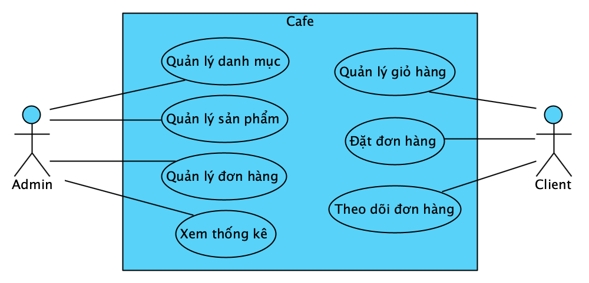

Hình: Sơ đồ use case tổng quan của hệ thống

Các use case được mô tả như sau:

• Đặt đơn hàng: UC này cho phép client xác nhận món từ giỏ hàng, nhập thông tin giao hàng và tạo đơn hàng.

• Theo dõi đơn hàng: UC này cho phép client tìm kiếm, theo dõi hoặc hủy đơn hàng đã đặt.

• Quản lý giỏ hàng: UC này cho phép client thêm món vào giỏ hàng, cài đặt tùy chọn hoặc bỏ món khỏi giỏ hàng.

• Quản lý sản phẩm: UC này cho phép admin thêm, chỉnh sửa, khóa hoặc xóa sản phẩm trong hệ thống.

• Quản lý danh mục: UC này cho phép admin thêm, chỉnh sửa và xóa danh mục sản phẩm trong hệ thống.

• Quản lý đơn hàng: UC này cho phép admin xem chi tiết đơn hàng, cập nhật trạng thái hoặc hủy đơn hàng.

• Xem thống kê: UC này cho phép admin xem thống kê theo món hoặc theo thời gian.

## Phân rã chi tiết các use case

1.  ***Use case đặt đơn hàng***

Để thực hiện đặt đơn hàng, client phải đăng nhập, xác nhận món từ giỏ hàng và nhập địa chỉ nhận hàng. Trong quá trình đặt hàng, client có thể tùy chọn thêm thông tin người nhận, số điện thoại hoặc ghi chú cho đơn hàng.

Mô tả các use case:

• Xác nhận món từ giỏ hàng: UC này cho phép client xác nhận các món đã chọn trong giỏ hàng trước khi đặt đơn.

• Điền địa chỉ nhận hàng: UC này cho phép client nhập địa chỉ nhận hàng cho đơn hàng.

• Tùy chọn thông tin đặt hàng: UC này cho phép client bổ sung thêm thông tin cho đơn hàng. Việc bổ sung thông tin có thể bao gồm tên người nhận, số điện thoại liên hệ hoặc ghi chú cho đơn hàng.

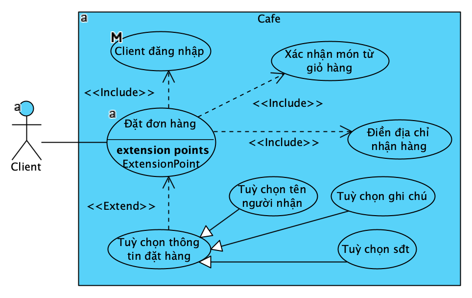

Hình: Chi tiết use case đặt đơn hàng

1.  ***Use case theo dõi đơn hàng***

Để theo dõi đơn hàng, client phải đăng nhập và tìm chọn đơn hàng cần xem. Trong quá trình theo dõi đơn hàng, client có thể hủy đơn hàng nếu đơn chưa được xử lý hoặc giao hàng.

Mô tả các use case:

• Tìm chọn đơn hàng: UC này cho phép client tìm kiếm và chọn đơn hàng cần theo dõi.

• Hủy đơn hàng: UC này cho phép client hủy đơn hàng đã đặt khi đơn hàng chưa được xử lý hoặc giao cho khách hàng.

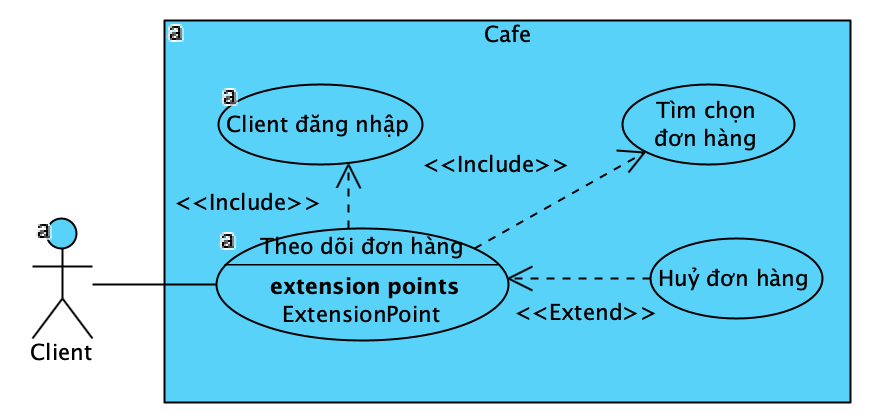

Hình: Chi tiết use case theo dõi đơn hàng

1.  ***Use case quản lý giỏ hàng***

Để quản lý giỏ hàng, client phải đăng nhập và chọn món muốn thêm vào giỏ. Trong quá trình thêm món, client có thể cài đặt các tùy chọn cho món uống như số lượng, size, mức đá, mức đường hoặc ghi chú. Client cũng có thể bỏ món khỏi giỏ hàng khi không còn nhu cầu đặt món đó.

Mô tả các use case:

• Thêm đồ vào giỏ: UC này cho phép client thêm món vào giỏ hàng.

• Tìm chọn đồ: UC này cho phép client tìm kiếm và chọn món muốn thêm vào giỏ hàng.

• Cài đặt tùy chọn: UC này cho phép client tùy chỉnh thông tin cho món uống. Việc tùy chỉnh có thể bao gồm chọn số lượng, size, mức đá, mức đường hoặc thêm ghi chú cho món uống.

• Bỏ đồ khỏi giỏ: UC này cho phép client xóa món khỏi giỏ hàng.

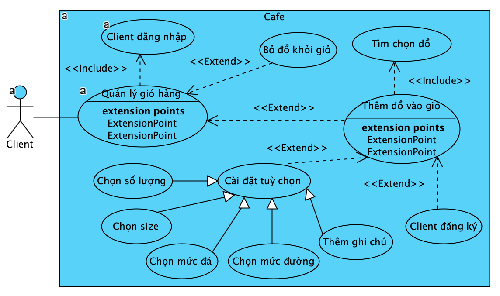

Hình: Chi tiết use case quản lý giỏ hàng

1.  ***Use case quản lý sản phẩm***

Quản lý sản phẩm cho phép admin thêm, chỉnh sửa, khóa hoặc xóa sản phẩm trong hệ thống. Để chỉnh sửa hoặc khóa sản phẩm, admin cần tìm chọn sản phẩm theo tên hoặc ID sản phẩm.

Mô tả các use case:

• Thêm sản phẩm: UC này cho phép admin thêm sản phẩm mới vào hệ thống.

• Chỉnh sửa sản phẩm: UC này cho phép admin cập nhật thông tin sản phẩm trong hệ thống.

• Khóa sản phẩm: UC này cho phép admin khóa sản phẩm để ngừng kinh doanh sản phẩm đó trên hệ thống.

• Xóa sản phẩm: UC này cho phép admin xóa sản phẩm khỏi hệ thống.

• Tìm chọn sản phẩm: UC này cho phép admin tìm kiếm sản phẩm để phục vụ chỉnh sửa hoặc khóa sản phẩm. Việc tìm kiếm có thể thực hiện theo tên sản phẩm hoặc ID sản phẩm.

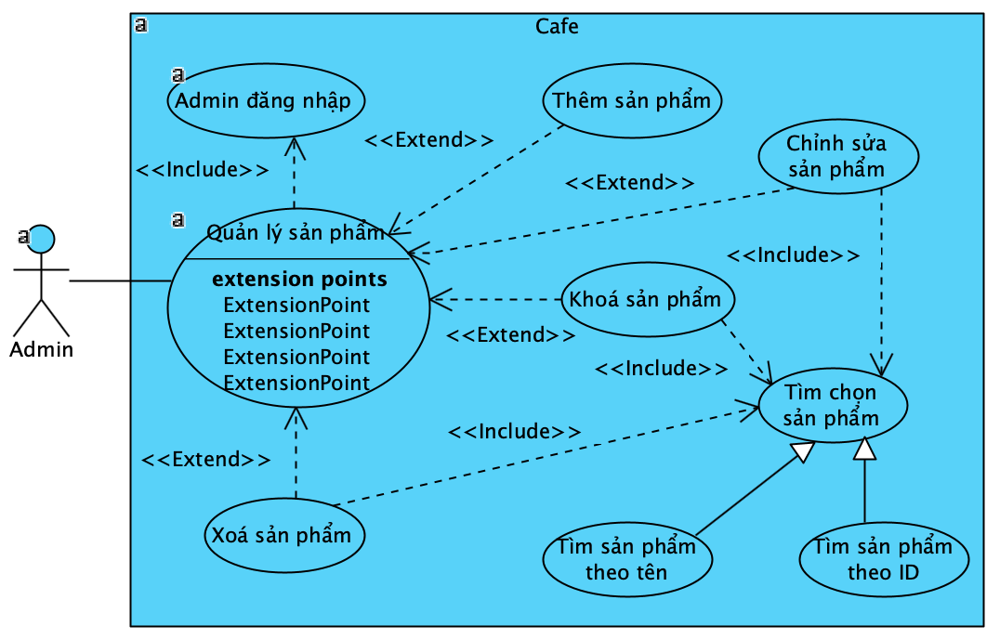

Hình: Chi tiết use case quản lý sản phẩm

1.  ***Use case quản lý danh mục***

Quản lý danh mục cho phép admin thêm, chỉnh sửa và xóa danh mục sản phẩm trong hệ thống. Để chỉnh sửa hoặc xóa danh mục, admin cần tìm chọn danh mục theo tên hoặc ID danh mục.

Mô tả các use case:

• Thêm danh mục: UC này cho phép admin thêm danh mục sản phẩm mới vào hệ thống.

• Chỉnh sửa danh mục: UC này cho phép admin cập nhật thông tin danh mục sản phẩm trong hệ thống.

• Xóa danh mục: UC này cho phép admin xóa danh mục sản phẩm khỏi hệ thống.

• Tìm chọn danh mục: UC này cho phép admin tìm kiếm danh mục để phục vụ chỉnh sửa hoặc xóa danh mục. Việc tìm kiếm có thể thực hiện theo tên danh mục hoặc ID danh mục.

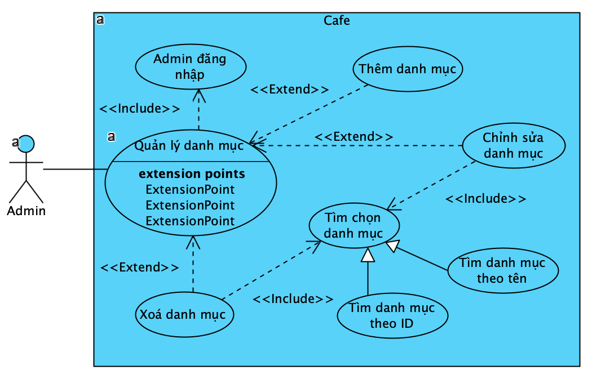

Hình: Chi tiết use case quản lý danh mục

1.  ***Use case quản lý đơn hàng***

Để quản lý đơn hàng, admin phải đăng nhập và tìm chọn đơn hàng cần xử lý. Trong quá trình quản lý đơn hàng, admin có thể xem chi tiết đơn hàng, cập nhật trạng thái đơn hàng hoặc hủy đơn hàng. Việc tìm kiếm đơn hàng có thể thực hiện theo tên khách hàng, ID đơn hàng hoặc số điện thoại khách hàng.

Mô tả các use case:

• Xem chi tiết đơn: UC này cho phép admin xem thông tin chi tiết của đơn hàng.

• Cập nhật trạng thái đơn: UC này cho phép admin cập nhật trạng thái xử lý của đơn hàng.

• Hủy đơn: UC này cho phép admin hủy đơn hàng trong trường hợp cần thiết.

• Tìm chọn đơn: UC này cho phép admin tìm kiếm đơn hàng để phục vụ xem chi tiết, cập nhật trạng thái hoặc hủy đơn hàng. Việc tìm kiếm có thể thực hiện theo tên khách hàng, ID đơn hàng hoặc số điện thoại khách hàng.

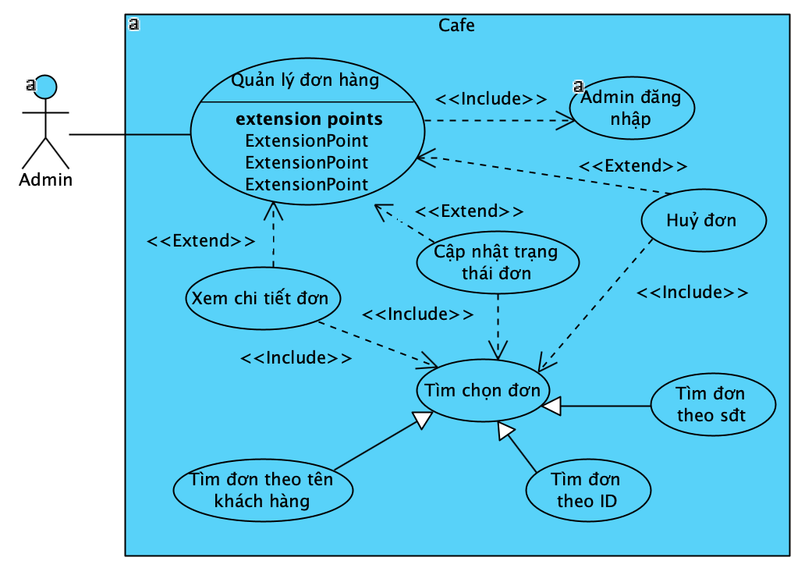

Hình: Chi tiết use case quản lý đơn hàng

1.  ***Use case xem thống kê***

Để xem thống kê, admin phải đăng nhập hệ thống và lựa chọn loại thống kê cần xem. Việc thống kê có thể thực hiện theo món hoặc theo thời gian.

Mô tả các use case:

• Xem thống kê theo món: UC này cho phép admin xem số lượng bán và doanh thu của từng món trong hệ thống.

• Xem thống kê theo thời gian: UC này cho phép admin xem doanh thu và số lượng đơn hàng theo khoảng thời gian cụ thể.

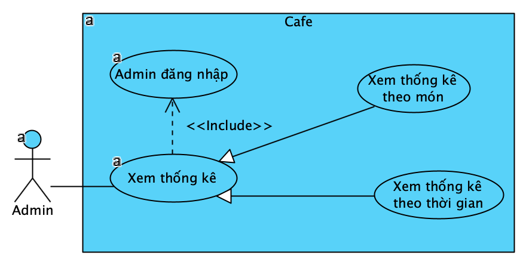

Hình: Chi tiết use case xem thống kê

# Phần 2. Pha phân tích (102-116)

## Các kịch bản (Làm theo phần được giao)

Mục đích của bước này là viết các kịch bản (scenario) cho các use case đã xác định được trong pha lấy yêu cầu. Để tập trung vào phần nghiệp vụ chuyên môn, các kịch bản trong mục này sẽ bỏ qua phần đăng nhập của các nhân viên cho ngắn gọn.

1.  ***Kịch bản đặt đơn hàng (UC đặt đơn hàng)***

| **Kịch bản đặt đơn hàng (UC đặt đơn hàng)** |  |
| --- | --- |
| **Use Case** | đặt đơn hàng |
| **Actor** | Client |
| **Tiền điều kiện** | Client đã đăng nhập thành công   Giỏ hàng đang chứa ít nhất một món. |
| **Hậu điều kiện** | Đơn hàng mới được tạo với trạng thái "Chờ xác nhận", giỏ hàng đã được làm trống. |
| **Kịch bản chính** | 1.Client: Chọn chức năng "Đặt đơn hàng" từ giao diện chính.   2.Hệ thống: Kiểm tra phiên đăng nhập và hiển thị danh sách món trong giỏ yêu cầu xác nhận.   3.Client: Kiểm tra danh sách món và nhấn nút "Xác nhận".   4.Hệ thống: Hiển thị form nhập thông tin giao hàng.   5.Client: Điền địa chỉ nhận hàng vào form.   6.Hệ thống: Hiển thị các trường thông tin mở rộng (extension points) cho đơn hàng.   7.Client: Điền thông tin tùy chọn (tên người nhận, SĐT, ghi chú) và nhấn nút "Xác nhận đặt hàng".   8.Hệ thống: Kiểm tra tính hợp lệ, lưu đơn hàng vào CSDL và hiển thị thông báo thành công. |
| **Ngoại lệ** | 2\. Giỏ hàng trống   5\. Địa chỉ ngoài khu vực |

1.  ***Kịch bản huỷ đơn hàng (UC theo dõi đơn hàng)***

| **Kịch bản huỷ đơn hàng (UC theo dõi đơn hàng)** |  |
| --- | --- |
| **Use Case** | Theo dõi đơn hàng |
| **Actor** | Client |
| **Tiền điều kiện** | Client đã đăng nhập thành công.   Tồn tại đơn hàng ở trạng thái cho phép huỷ ("Chờ xác nhận" hoặc "Đang chuẩn bị"). |
| **Hậu điều kiện** | Đơn hàng chuyển sang trạng thái "Đã huỷ" trên hệ thống. |
| **Kịch bản chính** | 1.Client: Chọn chức năng "Theo dõi đơn hàng".   2.Hệ thống: Xác thực phiên đăng nhập và hiển thị danh sách đơn hàng hiện tại/lịch sử.   3.Client: Tìm kiếm và nhấn chọn đơn hàng mục tiêu.   4.Hệ thống: Hiển thị chi tiết đơn hàng kèm nút chức năng "Huỷ đơn hàng".   5.Client: Nhấn nút "Huỷ đơn hàng".   6.Hệ thống: Hiển thị popup yêu cầu xác nhận và chọn lý do huỷ.   7.Client: Chọn lý do và nhấn nút "Đồng ý huỷ".   8.Hệ thống: Cập nhật trạng thái đơn hàng thành "Đã huỷ", ghi log lý do và thông báo kết quả. |
| **Ngoại lệ** | 4\. Đơn hàng đã qua trạng thái huỷ.   7\. Client từ chối xác nhận. |

1.  ***Kịch bản thêm đồ vào giỏ hàng (UC quản lý giỏ hàng)***

| **Kịch bản thêm đồ vào giỏ hàng (UC quản lý giỏ hàng)** |  |
| --- | --- |
| **Use Case** | Quản lý giỏ hàng |
| **Actor** | Client |
| **Tiền điều kiện** | Client đã đăng nhập thành công.   Giao diện danh sách món đang hiển thị. |
| **Hậu điều kiện** | Món hàng cùng tùy chọn được thêm vào giỏ. |
| **Kịch bản chính** | 1.Client: Duyệt danh sách món và nhấn chọn món muốn mua.   2.Hệ thống: Hiển thị form cấu hình chi tiết cho món đã chọn.   3.Client: Điền thông tin cấu hình (số lượng, size, mức đá/đường, ghi chú) và nhấn nút "Thêm".   4.Hệ thống: Kiểm tra tính hợp lệ của tùy chọn và tồn kho thực tế.   5.Client: Xem thông tin tóm tắt trên popup xác nhận và nhấn "Đồng ý thêm".   6.Hệ thống: Cập nhật giỏ hàng, hiển thị thông báo thành công và trả về giao diện quản lý giỏ. |
| **Ngoại lệ** | 3\. Thiếu thông tin bắt buộc (size, số lượng,...)   4\. Món tạm hết hàng. |

1.  ***Kịch bản chỉnh sửa giá sản phẩm (UC quản lý sản phẩm)***

| **UC chỉnh sửa giá sản phẩm (UC Quản lý sản phẩm)** |  |
| --- | --- |
| **Use case** | Chỉnh sửa giá sản phẩm |
| **Actor** | Admin |
| **Tiền điều kiện** | Admin đã đăng nhập thành công và đang ở giao diện quản lý sản phẩm |
| **Hậu điều kiện** | Giá sản phẩm được cập nhật thành công trong hệ thống |
| **Kịch bản chính** | 1\. Admin nhập tên hoặc mã sản phẩm vào ô tìm kiếm.   2\. Hệ thống hiển thị danh sách sản phẩm phù hợp với từ khóa.   3\. Admin chọn sản phẩm cần chỉnh sửa và nhấn nút "Chỉnh sửa".   4\. Hệ thống hiển thị giao diện chi tiết sản phẩm: mã, tên, danh mục, giá hiện tại, mô tả.   5\. Admin nhấn vào ô "Giá", nhập giá mới rồi click nút "Lưu".   6\. Hệ thống kiểm tra tính hợp lệ của giá (phải là số dương, không vượt quá giới hạn).   7\. Hệ thống cập nhật giá và hiển thị thông báo "Cập nhật giá thành công".   8\. Admin được chuyển về danh sách sản phẩm; sản phẩm hiển thị giá mới. |
| **Ngoại lệ** | 3a. Không tìm thấy sản phẩm theo từ khóa.   6a. Giá nhập vào không hợp lệ (âm, bằng 0, hoặc chứa ký tự không phải số).   6b. Giá mới vượt quá giới hạn tối đa cho phép. |

1.  ***Kịch bản thêm danh mục (UC quản lý danh mục)***

| **UC thêm danh mục (UC Quản lý danh mục)** |  |
| --- | --- |
| **Use case** | Thêm danh mục |
| **Actor** | Admin |
| **Tiền điều kiện** | Admin đã đăng nhập thành công và đang ở giao diện quản lý danh mục |
| **Hậu điều kiện** | Danh mục mới được thêm thành công và hiển thị trong danh sách |
| **Kịch bản chính** | 1\. Admin nhấn vào nút "Thêm danh mục" từ giao diện quản lý danh mục.   2\. Hệ thống hiển thị form thêm danh mục với các trường: Tên danh mục (\*), Mô tả, Danh mục cha (tùy chọn), Trạng thái (Hoạt động / Không hoạt động); kèm nút "Lưu" và "Hủy".   3\. Admin điền tên danh mục (bắt buộc), chọn danh mục cha nếu muốn tạo danh mục con, chọn trạng thái và nhấn "Lưu".   4\. Hệ thống kiểm tra tính hợp lệ: tên không được để trống, không được trùng với danh mục đã có.   5\. Hệ thống thêm danh mục mới và hiển thị thông báo "Thêm danh mục thành công".   6\. Admin được chuyển về danh sách danh mục; danh mục mới xuất hiện trong danh sách. |
| **Ngoại lệ** | 4a. Tên danh mục bị để trống.   4b. Tên danh mục đã tồn tại. |

1.  ***Kịch bản xem chi tiết đơn hàng (UC quản lý đơn hàng)***

| **UC xem chi tiết đơn hàng (UC Quản lý đơn hàng)** |  |
| --- | --- |
| **Use case** | Xem chi tiết đơn hàng |
| **Actor** | Admin |
| **Tiền điều kiện** | Admin đã đăng nhập thành công và đang ở giao diện quản lý đơn hàng |
| **Hậu điều kiện** | Admin xem được đầy đủ thông tin chi tiết của đơn hàng |
| **Kịch bản chính** | 1\. Admin nhập mã đơn hàng, tên khách hàng hoặc lọc theo ngày/trạng thái trong giao diện quản lý đơn hàng.   2\. Hệ thống hiển thị danh sách đơn hàng phù hợp: STT \| Mã đơn hàng \| Khách hàng \| Ngày đặt \| Tổng tiền \| Trạng thái.   3\. Admin nhấn vào mã đơn hàng hoặc nút "Xem chi tiết" của đơn hàng cần xem.   4\. Hệ thống hiển thị giao diện chi tiết đơn hàng bao gồm:   • Thông tin đơn hàng: Mã, Ngày đặt, Trạng thái, Phương thức thanh toán.   • Thông tin khách hàng: Tên, Số điện thoại, Địa chỉ giao hàng.   • Danh sách sản phẩm: STT \| Tên sản phẩm \| Số lượng \| Đơn giá \| Thành tiền.   • Tổng cộng: Tạm tính, Phí vận chuyển, Giảm giá (nếu có), Tổng thanh toán.   5\. Admin xem xong, nhấn "Quay lại" để trở về danh sách hoặc thực hiện các thao tác khác (cập nhật trạng thái, in đơn hàng). |
| **Ngoại lệ** | 2a. Không tìm thấy đơn hàng theo điều kiện tìm kiếm.   4a. Đơn hàng không tồn tại hoặc đã bị xóa. |

1.  ***Kịch bản xem thống kê theo món (UC xem thống kê)***

| **UC xem thống kê theo món (UC Xem thống kê)** |  |
| --- | --- |
| **Use case** | Xem thống kê theo món |
| **Actor** | Admin |
| **Tiền điều kiện** | Admin đã đăng nhập thành công và đang ở giao diện xem thống kê |
| **Hậu điều kiện** | Admin xem được báo cáo thống kê doanh thu và số lượng bán theo từng món trong khoảng thời gian đã chọn |
| **Kịch bản chính** | 1\. Admin chọn mục "Thống kê" → "Thống kê theo món" từ giao diện chính.   2\. Hệ thống hiển thị giao diện thống kê với bộ lọc: Khoảng thời gian (Từ ngày – Đến ngày), Danh mục sản phẩm (Tất cả / chọn cụ thể), và nút "Xem thống kê".   3\. Admin chọn khoảng thời gian, chọn danh mục (hoặc để mặc định "Tất cả") rồi nhấn "Xem thống kê".   4\. Hệ thống truy vấn dữ liệu và hiển thị bảng thống kê: STT \| Tên món \| Danh mục \| Số lượng bán \| Doanh thu \| % Tổng doanh thu (kèm biểu đồ cột hoặc biểu đồ tròn).   5\. Admin xem bảng tổng hợp phía dưới: Tổng số món đã bán, Tổng doanh thu, Món bán chạy nhất.   6\. Admin nhấn "Xuất báo cáo" để tải file Excel/PDF hoặc nhấn "In" để in báo cáo. |
| **Ngoại lệ** | 3a. Khoảng thời gian không hợp lệ (ngày bắt đầu lớn hơn ngày kết thúc).   4a. Không có dữ liệu bán hàng trong khoảng thời gian đã chọn. |

## Trích các lớp thực thể (Thi)

Mô tả hệ thống trong một đoạn văn như sau:

Hệ thống quản lý quán cà phê là một ứng dụng web hỗ trợ quản lý hoạt động kinh doanh của quán cà phê. Hệ thống quản lý thông tin về tài khoản người dùng, sản phẩm, danh mục sản phẩm và đơn hàng. Hệ thống cho phép khách hàng đăng ký tài khoản, đăng nhập, tìm kiếm sản phẩm, thêm sản phẩm vào giỏ hàng, quản lý giỏ hàng, đặt đơn hàng và theo dõi trạng thái đơn hàng. Hệ thống cũng cho phép quản trị viên quản lý sản phẩm, quản lý danh mục và quản lý đơn hàng của khách hàng.

Như vậy, ta có các danh từ và các phân tích như sau:

-   Hệ thống: danh từ chung chung → loại.
-   Thông tin: danh từ chung chung → loại.
-   Tài khoản người dùng: là đối tượng xử lí của hệ thống → là 1 lớp thực thể: Users.
-   Khách hàng: là đối tượng sử dụng hệ thống → được quản lí thông qua lớp Users.
-   Admin/Quản lý: không phải đối tượng xử lí trực tiếp nhưng được quản lí như người dùng của hệ thống → sử dụng chung lớp Users.
-   Sản phẩm: là đối tượng xử lí của hệ thống → là 1 lớp thực thể: Products.
-   Danh mục sản phẩm: là đối tượng xử lí của hệ thống → là 1 lớp thực thể: Categories.
-   Đơn hàng: là đối tượng xử lí của hệ thống → là 1 lớp thực thể: Orders.
-   Giỏ hàng: được quản lí thông qua lớp liên kết CartItems.
-   Mã đơn hàng: không phải lớp thực thể → là thuộc tính của lớp Orders (tracking\_code).

Vậy chúng ta thu được các lớp thực thể ban đầu là: Users, Products, Categories, Orders, CartItems.

Quan hệ giữa các lớp thực thể được xác định như sau:

-   Một Categories có nhiều Products, một Products chỉ thuộc vào một Categories. Vậy quan hệ giữa Categories và Products là 1-n.
-   Một Users có thể đặt nhiều Orders, nhưng một Orders chỉ thuộc về một Users. Vậy quan hệ giữa Users và Orders là 1-n.
-   Một Orders có thể chứa nhiều Products, và một Products có thể xuất hiện trong nhiều Orders khác nhau của nhiều khách hàng khác nhau. Vậy quan hệ giữa Orders và Products là n-n. Do đó có thể bổ sung một lớp thực thể liên kết giữa hai đối tượng này là OrderItems (thông tin chi tiết sản phẩm trong đơn hàng).
-   Một Orders và một Products xác định duy nhất một OrderItems. Liên kết này xác định thêm các thông tin: số lượng (quantity), đơn giá (unit\_price), tùy chọn sản phẩm (options)
-   Một Users có thể thêm nhiều Products vào giỏ hàng, và một Products có thể xuất hiện trong giỏ hàng của nhiều Users khác nhau. Vậy quan hệ giữa Users và Products là n-n. Do đó đề xuất bổ sung lớp CartItems làm cầu nối giữa Users và Products.
-   Một Users và một Products xác định duy nhất một CartItems. Liên kết này xác định thêm các thông tin: số lượng (quantity), tùy chọn sản phẩm (options)

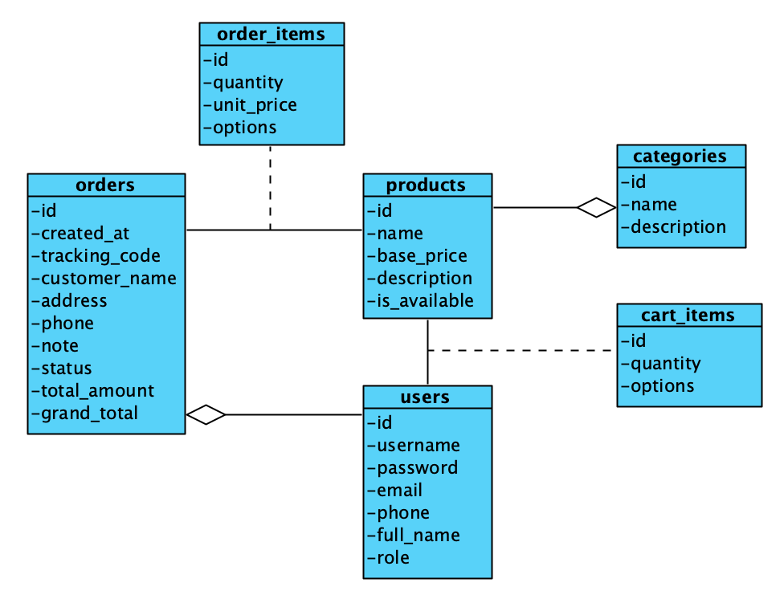

Hình: Biểu đồ lớp thực thể pha phân tích

## Phân tích chi tiết từng module (Làm theo use case được giao)

1.  **Chức năng đặt đơn hàng**

Phân tích chi tiết chức năng

Phân tích chi tiết chức năng đặt đơn hàng diễn ra như sau:

-   Vào hệ thống → giao diện login hiện lên → đề xuất lớp LoginView, có 2 ô nhập username, password và nút Login.
-   Nhập username/password → hệ thống phải kiểm tra thông tin đăng nhập → cần chức năng checkLogin() → chức năng này là hành động của đối tượng Users.
-   Login thành công, hệ thống hiện giao diện chính của khách hàng → đề xuất lớp HomeView, có ít nhất nút chọn vào giỏ hàng.
-   Click vào nút giỏ hàng → hệ thống gọi giao diện giỏ hàng → đề xuất lớp CartView.
-   Hệ thống cần hiển thị các sản phẩm đã có trong giỏ hàng → cần chức năng getAllCart() → chức năng này là hành động của đối tượng CartItems.
-   Kết quả danh sách sản phẩm được hiển thị trên giao diện CartView, gồm danh sách sản phẩm trong giỏ và nút Checkout.
-   Click nút Checkout → giao diện thanh toán hiện lên → đề xuất lớp CheckoutView, có các ô nhập: tên khách hàng, số điện thoại, địa chỉ nhận hàng, ghi chú cùng nút xác nhận đặt hàng.
-   Khách hàng nhập thông tin giao hàng và click nút xác nhận đặt hàng → hệ thống tạo đơn hàng → cần chức năng createOrder() → chức năng này là hành động của đối tượng Orders.
-   Sau khi tạo đơn hàng thành công → hệ thống gọi chức năng clearCart() để xóa các sản phẩm đã checkout khỏi giỏ hàng → chức năng này là hành động của đối tượng CartItems.
-   Hệ thống sinh mã đơn hàng → giao diện theo dõi đơn hàng hiện lên → đề xuất lớp OrderView, hiển thị mã tracking code của đơn hàng.

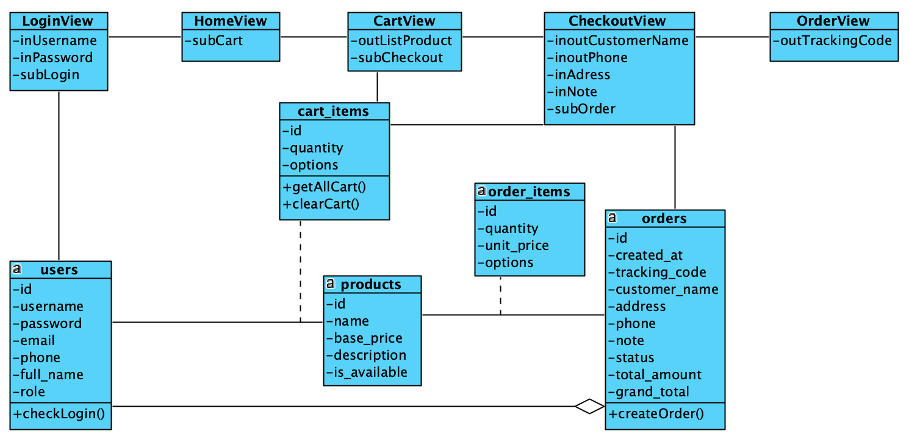

Hình: Biểu đồ lớp phân tích chức năng đặt đơn hàng

Như vậy, kết quả thu được biểu đồ lớp cho chức năng đặt đơn hàng như trong hình trên. Với biểu đồ lớp này, kịch bản chi tiết cho chức năng đặt đơn hàng diễn ra như sau :

-   Client nhập username/password vào giao diện đăng nhập và click nút Login.
-   Lớp LoginView gọi đến lớp Users để xử lí.
-   Lớp Users gọi hàm kiểm tra đăng nhập. Kết quả đăng nhập thành công.
-   Lớp Users gửi kết quả lại cho lớp LoginView.
-   Lớp LoginView gọi sang lớp HomeView.
-   Lớp HomeView hiển thị cho client.
-   Client click vào chức năng giỏ hàng.
-   Lớp HomeView gọi lớp CartView.
-   Lớp CartView hiển thị danh sách sản phẩm trong giỏ hàng cho client.
-   Client click vào chức năng Checkout.
-   Lớp CartView gọi sang lớp CheckoutView.
-   Lớp CheckoutView hiển thị cho client.
-   Client nhập địa chỉ giao hàng và các thông tin cần thiết.
-   Lớp CheckoutView hiển thị lại thông tin đặt hàng cho client xác nhận.
-   Client click nút Checkout.
-   Lớp CheckoutView gọi lớp Orders xử lí.
-   Lớp Orders gọi phương thức tạo đơn hàng createOrder().
-   Kết quả được lớp Orders gửi lại cho lớp CheckoutView.
-   Lớp CheckoutView gọi sang lớp OrderView.
-   Lớp OrderView hiển thị mã tracking code của đơn hàng cho client.

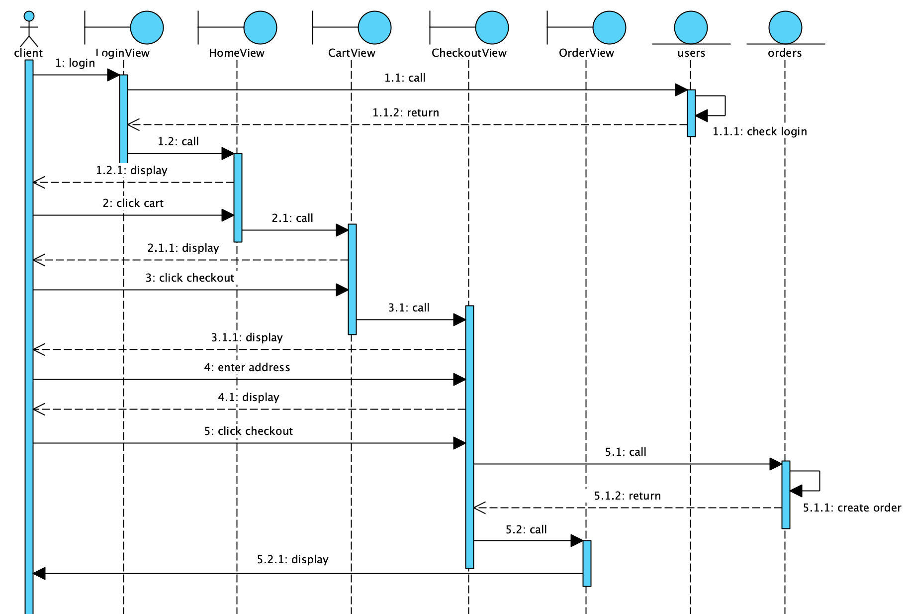

Hình: Biểu đồ tuần tự phân tích chức năng đặt đơn hàng

1.  ***Chức năng huỷ đơn hàng (UC theo dõi đơn hàng)***

Phân tích chi tiết chức năng huỷ đơn hàng

Phân tích chi tiết chức năng hủy đơn hàng diễn ra như sau:  
Phân tích chi tiết chức năng: Hủy Đơn Hàng

**Vào hệ thống → giao diện login hiện lên** → đề xuất lớp LoginView, có 2 ô nhập username, password và nút Login.

**Nhập username/password → hệ thống kiểm tra thông tin đăng nhập** → cần chức năng checkLogin() → chức năng này là hành động của đối tượng Users.

**Login thành công, hệ thống hiện giao diện chính** → đề xuất lớp HomeView, có ít nhất nút "Đơn hàng của tôi".

**Click vào nút "Đơn hàng của tôi" → hệ thống gọi giao diện danh sách đơn hàng** → đề xuất lớp OrderListView. Hệ thống cần hiển thị toàn bộ đơn hàng của khách → cần chức năng getAllOrders() → chức năng này là hành động của đối tượng Orders. Kết quả hiển thị danh sách đơn hàng, mỗi đơn có nút **Hủy**.

**Click nút Hủy trên một đơn hàng → giao diện xác nhận hủy hiện lên** → đề xuất lớp CancelConfirmView, có: dropdown/radio chọn lý do hủy, nút **Xác nhận hủy** và nút **Quay lại**. Hệ thống đồng thời tải thông tin chi tiết đơn → cần chức năng getOrderDetail() → hành động của đối tượng Orders.

**Khách hàng chọn lý do và click xác nhận → hệ thống kiểm tra trạng thái đơn hàng** → cần chức năng checkOrderStatus() → hành động của đối tượng Orders. Đây là bước rẽ nhánh quan trọng:

-   Nếu đơn **đang chờ xử lý** (pending) → cho phép hủy, tiếp tục luồng.
-   Nếu đơn **đã giao / đang vận chuyển** → không thể hủy → hiển thị ErrorView thông báo lý do.

**Trạng thái hợp lệ → hệ thống thực hiện hủy đơn** → cần chức năng cancelOrder() → hành động của đối tượng Orders. Chức năng này cập nhật trạng thái đơn thành "Đã hủy" kèm lý do hủy và thời điểm hủy.

**Sau khi hủy thành công → hệ thống hoàn trả tồn kho** → cần chức năng restoreStock() → hành động của đối tượng Products. Chức năng này cộng lại số lượng tồn kho tương ứng với các sản phẩm trong đơn bị hủy.

**Hệ thống gửi thông báo xác nhận hủy đến khách hàng** → cần chức năng sendCancelNotification() → hành động của đối tượng Notifications. Thông báo qua email hoặc SMS, gồm mã đơn hàng và lý do hủy.

**Hệ thống hiển thị giao diện kết quả** → đề xuất lớp OrderCancelledView, hiển thị mã đơn hàng và trạng thái **"Đã hủy"** để xác nhận với khách hàng

  
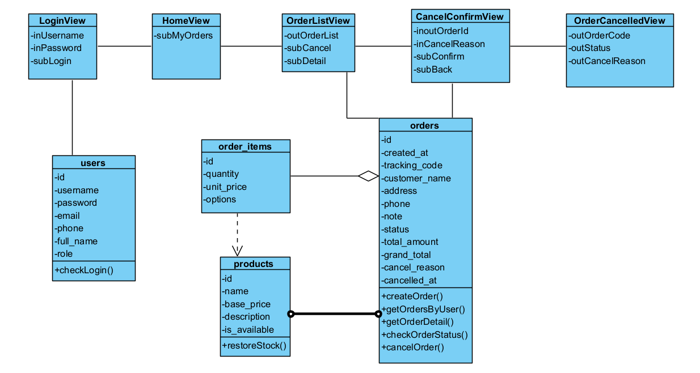

Hình: Biểu đồ lớp phân tích chức năng hủy đơn hàng

Như vậy, kết quả thu được biểu đồ lớp cho chức năng hủy đơn hàng như trong hình trên. Với biểu đồ lớp này, kịch bản chi tiết cho chức năng hủy đơn hàng diễn ra như sau :

1.  Client nhập username/password vào giao diện đăng nhập và click nút Login.
2.  Lớp LoginView gọi đến lớp Users để xử lý.
3.  Lớp Users gọi hàm checkLogin(). Kết quả đăng nhập thành công.
4.  Lớp Users gửi kết quả lại cho lớp LoginView.
5.  Lớp LoginView gọi sang lớp HomeView.
6.  Lớp HomeView hiển thị giao diện chính cho client.
7.  Client click vào chức năng "Đơn hàng của tôi".
8.  Lớp HomeView gọi lớp OrderListView.
9.  Lớp OrderListView gọi đến lớp Orders để lấy dữ liệu, gọi phương thức getOrdersByUser().
10.  Kết quả được lớp Orders gửi lại cho lớp OrderListView.
11.  Lớp OrderListView hiển thị danh sách đơn hàng cho client. Mỗi đơn hàng có nút **Hủy**.
12.  Client click nút "Hủy" trên một đơn hàng cụ thể.
13.  Lớp OrderListView gọi sang lớp CancelConfirmView.
14.  Lớp CancelConfirmView gọi lớp Orders để lấy thông tin đơn hàng, gọi phương thức getOrderDetail().
15.  Kết quả từ Orders được gửi về lớp CancelConfirmView.
16.  Lớp CancelConfirmView hiển thị thông tin đơn hàng, dropdown chọn lý do hủy và nút xác nhận cho client.
17.  Client chọn lý do hủy và click nút xác nhận hủy đơn.
18.  Lớp CancelConfirmView gọi lớp Orders kiểm tra trạng thái đơn hàng, gọi phương thức checkOrderStatus(). Kết quả: đơn hàng hợp lệ để hủy.
19.  Lớp Orders thực hiện hủy đơn, gọi phương thức cancelOrder(). Trạng thái đơn hàng được cập nhật thành "Đã hủy".
20.  Lớp Orders gọi lớp Products để hoàn trả số lượng tồn kho, gọi phương thức restoreStock().
21.  Lớp Orders gọi lớp Notifications để gửi thông báo xác nhận hủy đến client, gọi phương thức sendCancelNotification().
22.  Kết quả hủy thành công được gửi về lớp CancelConfirmView.
23.  Lớp CancelConfirmView gọi sang lớp OrderCancelledView.
24.  Lớp OrderCancelledView hiển thị trạng thái **"Đã hủy"** cùng mã đơn hàng cho client.

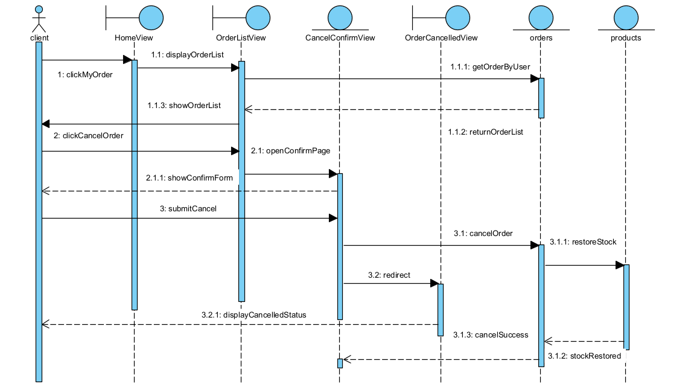

Hình: Biểu đồ tuần tự phân tích chức năng hủy đơn hàng

1.  ***Chức năng thêm đồ vào giỏ hàng (UC quản lý giỏ hàng)***

Phân tích chi tiết chức năng thêm đồ vào giỏ hàng

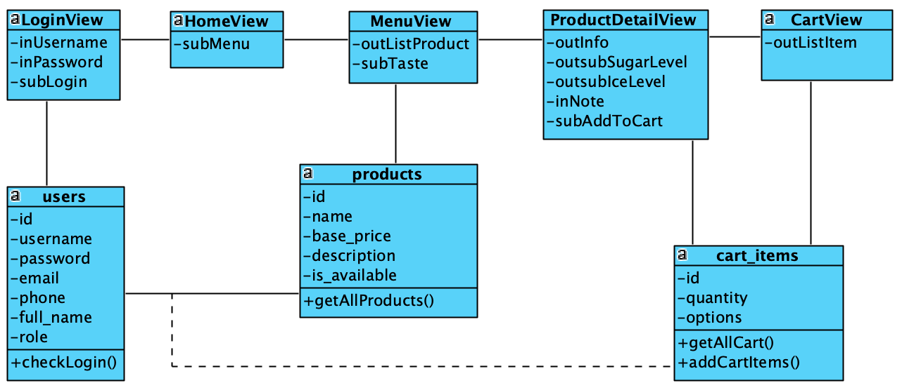

Hình: Biểu đồ lớp phân tích chức năng quản lý giỏ hàng

Như vậy, kết quả thu được biểu đồ lớp cho chức năng quản lý giỏ hàng như trong hình trên. Với biểu đồ lớp này, kịch bản chi tiết cho chức năng quản lý giỏ hàng diễn ra như sau :

-   Khách hàng login.
-   Lớp LoginView gọi lớp users thực hiện chức năng checkLogin.
-   Check xong, lớp LoginView gọi sang lớp HomeView hiển thị cho khách hàng.
-   Khách hàng click Menu.
-   Lớp HomeView gọi sang lớp MenuView hiển thị.
-   Lớp MenuView gọi lớp products thực hiện chức năng getAllProducts.
-   Lấy xong, lớp products trả kết quả về cho lớp MenuView hiển thị lên cho khách hàng danh sách món.
-   Khách hàng click Taste.
-   Lớp MenuView gọi sang lớp ProductDetailView hiển thị chi tiết món và tuỳ chọn.
-   Khách hàng click AddToCart.
-   Lớp ProductDetailView gọi lớp cart\_items thực hiện chức năng addCartItems.
-   Thêm xong, lớp cart\_items trả kết quả về cho lớp ProductDetailView.
-   Lớp ProductDetailView gọi sang lớp CartView.
-   Lớp CartView gọi lớp cart\_items thực hiện chức năng getAllCart.
-   Lấy xong danh sách món trong giỏ hàng, lớp CartView hiển thị cho khách hàng.

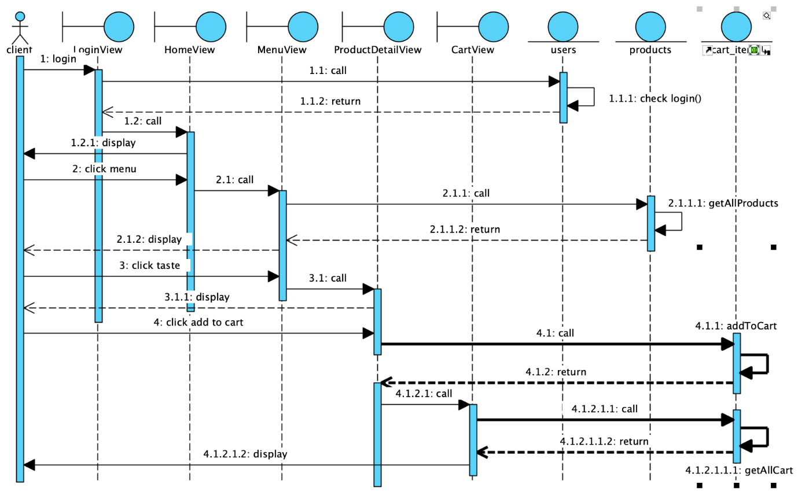

Hình: Biểu đồ tuần tự phân tích chức năng quản lý giỏ hàng

1.  ***Chức năng chỉnh sửa giá sản phẩm (UC quản lý sản phẩm)***

Phân tích chi tiết chức năng chỉnh sửa giá sản phẩm

-   Vào hệ thống → giao diện login hiện lên → đề xuất lớp LoginView, có 2 ô nhập username, password và nút Login.
-   Nhập username/password → hệ thống phải kiểm tra thông tin đăng nhập → cần chức năng checkLogin() → chức năng này là hành động của đối tượng Users.
-   Login thành công → hệ thống hiện giao diện chính của admin → đề xuất lớp AdminHomeView, có ít nhất nút chọn vào quản lý sản phẩm.
-   Click vào nút quản lý sản phẩm → giao diện quản lý sản phẩm hiện lên → đề xuất lớp ManageProductView, có ô tìm kiếm sản phẩm, danh sách sản phẩm và nút chỉnh sửa sản phẩm.
-   Admin nhập từ khóa và click nút tìm kiếm → hệ thống tìm sản phẩm tương ứng → cần chức năng searchProduct() → chức năng này là hành động của đối tượng Products.
-   Kết quả tìm kiếm được hiển thị trên giao diện ManageProductView.
-   Admin click vào chức năng chỉnh sửa của một sản phẩm → hiển thị giao diện chi tiết sản phẩm → đề xuất lớp EditProductView, có các thông tin sản phẩm, ô chỉnh sửa giá và nút lưu.
-   Chỉnh sửa giá sản phẩm xong nhấn nút lưu → hệ thống lưu vào CSDL → cần chức năng updatePrice() → chức năng này là hành động của đối tượng Products.
-   Sau khi cập nhật thành công → hệ thống quay về giao diện chính của quản lý sản phẩm ManageProductView.

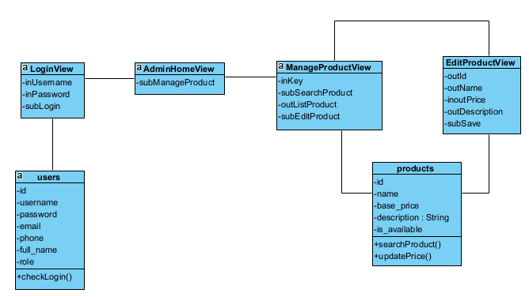

Hình: Biểu đồ lớp phân tích chức năng chỉnh sửa giá sản phẩm

Như vậy, kết quả thu được biểu đồ lớp cho chức năng chỉnh sửa giá sản phẩm như trong hình trên. Với biểu đồ lớp này, kịch bản chi tiết cho chức năng chỉnh sửa giá sản phẩm diễn ra như sau :

-   Admin nhập username/password vào giao diện đăng nhập và click nút Login
-   Lớp LoginView gọi đến lớp Users để xử lí
-   Lớp Users gọi hàm kiểm tra đăng nhập. Kết quả đăng nhập thành công
-   Lớp Users gửi kết quả lại cho lớp LoginView
-   Lớp LoginView gọi sang lớp AdminHomeView.
-   Lớp AdminHomeView hiển thị cho admin.
-   Admin click vào chức năng quản lý sản phẩm.
-   Lớp AdminHomeView gọi lớp ManageProductView.
-   Lớp ManageProductView hiển thị cho admin.
-   Admin nhập từ khóa và click nút tìm kiếm sản phẩm.
-   Lớp ManageProductView gọi lớp Products xử lí.
-   Lớp Products gọi phương thức tìm kiếm sản phẩm searchProduct().
-   Kết quả được lớp Products gửi lại cho lớp ManageProductView.
-   Lớp ManageProductView hiển thị danh sách sản phẩm tìm được cho admin.
-   Admin click vào chức năng chỉnh sửa của một sản phẩm.
-   Lớp ManageProductView gọi sang lớp EditProductView.
-   Lớp EditProductView hiển thị cho admin với các thông tin hiện có của sản phẩm.
-   Admin chỉnh sửa giá sản phẩm và click nút Lưu.
-   Lớp EditProductView gọi lớp Products xử lí.
-   Lớp Products gọi phương thức cập nhật giá sản phẩm updatePrice().
-   Kết quả được lớp Products gửi lại cho lớp EditProductView.
-   Lớp EditProductView gọi lại lớp ManageProductView.
-   Lớp ManageProductView hiển thị cho admin.

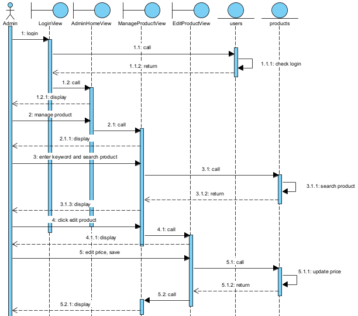

Hình: Biểu đồ tuần tự phân tích chức năng chỉnh sửa giá sản phẩm

1.  ***Chức năng thêm danh mục (UC quản lý danh mục)***

Phân tích chi tiết chức năng thêm danh mục

-   Vào hệ thống → giao diện login hiện lên → đề xuất lớp LoginView, có 2 ô nhập username, password và nút Login.
-   Nhập username/password → hệ thống phải kiểm tra thông tin đăng nhập → cần chức năng checkLogin() → chức năng này là hành động của đối tượng Users.
-   Login thành công → hệ thống hiện giao diện chính của admin → đề xuất lớp AdminHomeView, có ít nhất nút chọn vào quản lý danh mục.
-   Click vào nút quản lý danh mục → giao diện quản lý danh mục hiện lên → đề xuất lớp ManageCategoryView, có ít nhất nút thêm danh mục.
-   re
-   Sau khi thêm thành công → hệ thống quay về giao diện chính của quản lý danh mục ManageCategoryView.

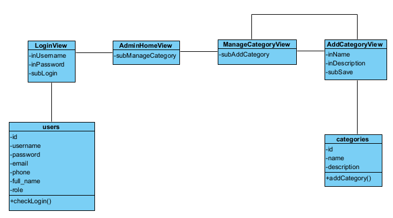

Hình: Biểu đồ lớp phân tích chức năng thêm danh mục

Như vậy, kết quả thu được biểu đồ lớp cho chức năng thêm danh mục như trong hình trên. Với biểu đồ lớp này, kịch bản chi tiết cho chức năng thêm danh mục diễn ra như sau :

-   Admin nhập username/password vào giao diện đăng nhập và click nút Login.
-   Lớp LoginView gọi đến lớp Users để xử lí.
-   Lớp Users gọi hàm kiểm tra đăng nhập. Kết quả đăng nhập thành công.
-   Lớp Users gửi kết quả lại cho lớp LoginView.
-   Lớp LoginView gọi sang lớp AdminHomeView.
-   Lớp AdminHomeView hiển thị cho admin.
-   Admin click vào chức năng quản lý danh mục.
-   Lớp AdminHomeView gọi lớp ManageCategoryView.
-   Lớp ManageCategoryView hiển thị cho admin.
-   Admin click vào chức năng thêm danh mục.
-   Lớp ManageCategoryView gọi sang lớp AddCategoryView.
-   Lớp AddCategoryView hiển thị cho admin.
-   Admin nhập thông tin danh mục và click nút Lưu.
-   Lớp AddCategoryView gọi lớp Categories xử lí.
-   Lớp Categories gọi phương thức thêm danh mục addCategory().
-   Kết quả được lớp Categories gửi lại cho lớp AddCategoryView.
-   Lớp AddCategoryView gọi lại lớp ManageCategoryView.
-   Lớp ManageCategoryView hiển thị cho admin.

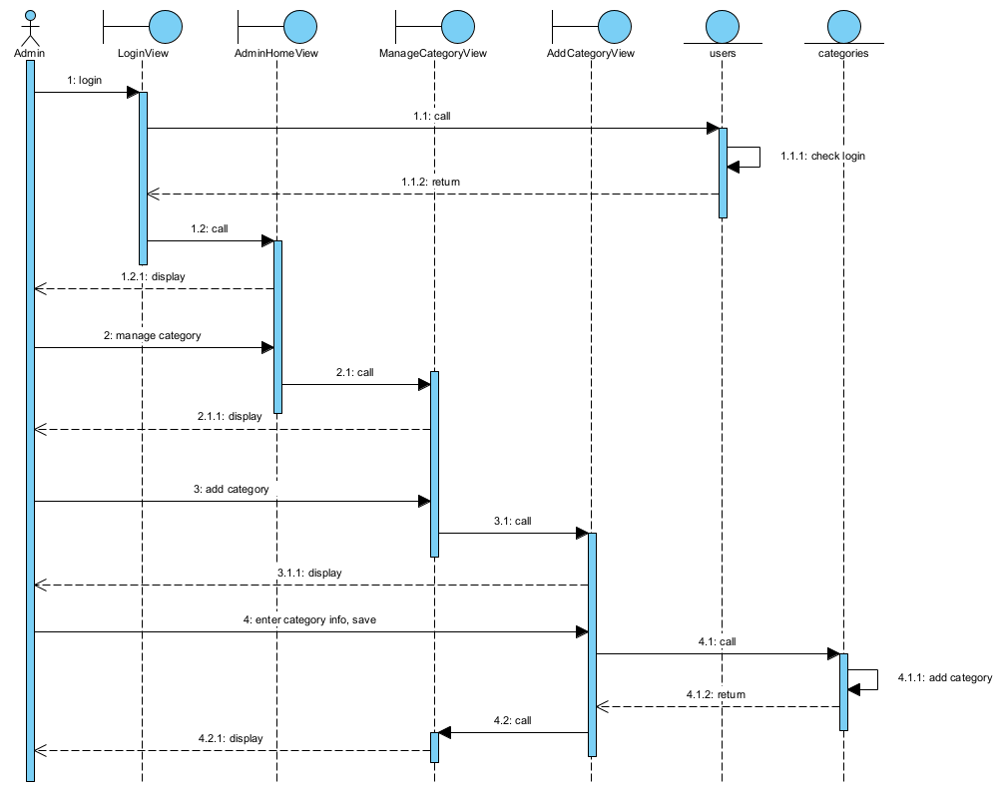

Hình: Biểu đồ tuần tự phân tích chức năng thêm danh mục

1.  ***Chức năng xem chi tiết đơn hàng (UC quản lý đơn hàng)***

Phân tích chi tiết chức năng xem chi tiết đơn hàng

Phân tích chi tiết chức năng xem chi tiết đơn hàng diễn ra như sau:

1.  Admin truy cập hệ thống → giao diện đăng nhập hiện lên → đề xuất lớp LoginView, có 2 ô nhập username, password và nút Login.
2.  Nhập username/password → hệ thống phải kiểm tra thông tin đăng nhập → cần chức năng checkLogin() → chức năng này là hành động của đối tượng Users.
3.  Đăng nhập thành công → hệ thống hiện giao diện quản trị → đề xuất lớp AdminDashboardView, có ít nhất nút "Quản lý đơn hàng".
4.  Click vào nút "Quản lý đơn hàng" → hệ thống gọi giao diện danh sách đơn hàng → đề xuất lớp OrderManagementView, có danh sách tất cả đơn hàng.
5.  Hệ thống cần hiển thị tất cả đơn hàng → cần chức năng getAllOrders() → chức năng này là hành động của đối tượng Orders.
6.  Kết quả danh sách đơn hàng được hiển thị trên giao diện OrderManagementView, gồm danh sách đơn hàng kèm nút "Xem chi tiết" cho từng đơn.
7.  Click nút "Xem chi tiết" → giao diện chi tiết đơn hàng hiện lên → đề xuất lớp OrderDetailView, hiển thị toàn bộ thông tin đơn hàng bao gồm thông tin đơn, thông tin khách hàng, danh sách sản phẩm và tổng cộng.
8.  Hệ thống cần lấy thông tin chi tiết đơn hàng (bao gồm cả danh sách sản phẩm) → cần chức năng getOrderDetail() → chức năng này là hành động của đối tượng Orders.
9.  Tất cả thông tin đơn hàng, trạng thái, thông tin khách hàng và danh sách sản phẩm được hiển thị đầy đủ trên OrderDetailView.

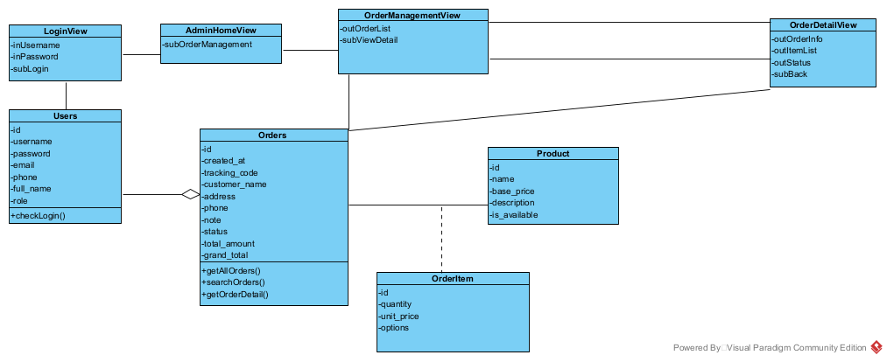

Hình: Biểu đồ lớp phân tích chức năng xem chi tiết đơn hàng

Như vậy, kết quả thu được biểu đồ lớp cho chức năng xem chi tiết đơn hàng như trong hình trên. Với biểu đồ lớp này, kịch bản chi tiết cho chức năng xem chi tiết đơn hàng diễn ra như sau :

1.  Admin nhập username/password vào giao diện đăng nhập và click nút Login.
2.  Lớp LoginView gọi đến lớp Users để xử lý.
3.  Lớp Users gọi hàm checkLogin(). Kết quả đăng nhập thành công.
4.  Lớp Users gửi kết quả lại cho lớp LoginView.
5.  Lớp LoginView gọi sang lớp AdminDashboardView.
6.  Lớp AdminDashboardView hiển thị giao diện quản trị cho admin.
7.  Admin click vào chức năng "Quản lý đơn hàng".
8.  Lớp AdminDashboardView gọi lớp OrderManagementView.
9.  Lớp OrderManagementView gọi đến lớp Orders để lấy dữ liệu, gọi phương thức getAllOrders().
10.  Kết quả được lớp Orders gửi lại cho lớp OrderManagementView.
11.  Lớp OrderManagementView hiển thị danh sách tất cả đơn hàng cho admin.
12.  Admin click nút "Xem chi tiết" trên một đơn hàng cụ thể.
13.  Lớp OrderManagementView gọi sang lớp OrderDetailView.
14.  Lớp OrderDetailView gọi lớp Orders để lấy thông tin chi tiết đơn hàng (bao gồm cả danh sách sản phẩm), gọi phương thức getOrderDetail().
15.  Kết quả được lớp Orders gửi về lớp OrderDetailView.
16.  Lớp OrderDetailView hiển thị đầy đủ thông tin đơn hàng, trạng thái, thông tin khách hàng và danh sách sản phẩm cho admin.

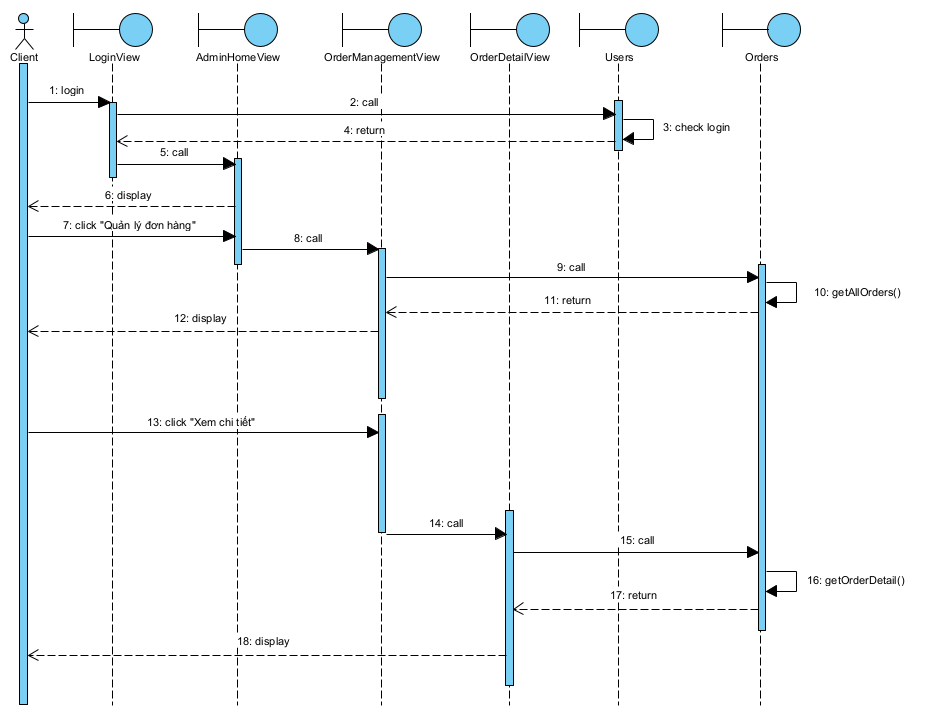

Hình: Biểu đồ tuần tự phân tích chức năng quản lý đơn hàng

1.  ***Chức năng xem thống kê theo món (UC xem thống kê)***

Phân tích chi tiết chức năng xem thống kê theo món

\-Vào hệ thống → giao diện login hiện lên → đề xuất lớp LoginView, có 2 ô nhập username, password và nút Login.

\-Nhập username/password → hệ thống phải kiểm tra thông tin đăng nhập → cần chức năng checkLogin() → chức năng này là hành động của đối tượng Users.

\-Admin login thành công, hệ thống hiện giao diện chính của admin → đề xuất lớp AdminHomeView, có ít nhất nút xem thống kê.

\-Click vào nút xem thống kê → hệ thống gọi dao diện xem thống kê → đề xuất lớp StatView có ô nhập tên món, nút lọc.

\-Hệ thống cần hiển thị thông tin sản phẩm với tên đã được chọn và doanh thu → cần chức năng getStatByProduct() → chức năng này là hành động của đối tượng orders

\-Kết quả thống kê được hiển thị trên giao diện StatView, gồm thông tin sản phẩm và tổng doanh thu sản phẩm

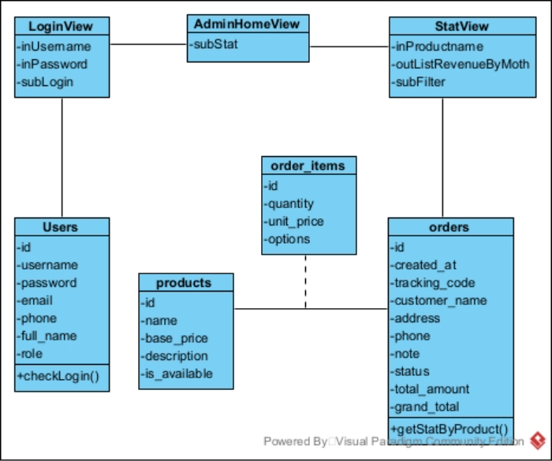

Hình: Biểu đồ lớp phân tích chức năng xem thống kê

Như vậy, kết quả thu được biểu đồ lớp cho chức năng xem thống kê như trong hình trên. Với biểu đồ lớp này, kịch bản chi tiết cho chức năng xem thống kê diễn ra như sau :

\-Client nhập username/password vào giao diện đăng nhập và click nút Login.

\-Lớp LoginView gọi đến lớp Users để xử lí.

\-Lớp Users gọi hàm kiểm tra đăng nhập. Kết quả đăng nhập thành công.

\-Lớp Users gửi kết quả lại cho lớp LoginView.

\-Lớp LoginView gọi sang lớp AdminHomeView.

\-Lớp AdminHomeView hiển thị cho client.

\-Client click vào chức năng xem thống kê

\-lớp AdminHomeView gọi lớp StatView

\-lớp StatView hiển thị cho Client tổng doanh thu của tất cả các sản phẩm

\-Client Click vào ô ProductName, điền tên sản phẩm

\-Lớp StatView hiển thị lại tên sản phẩm cho Client xác nhận

\-Client click nút Filter

\-Lớp StatView gọi lớp Orders xử lý

\-Lớp Orders gọi phương thức lấy thông tin theo sản phẩm getStatByProduct()

\-Kết quả được lớp Orders gửi lại cho lớp StatView

\-Lớp StatView hiển thị thông tin sản phẩm và tổng doanh thu của các sản phẩm cho client

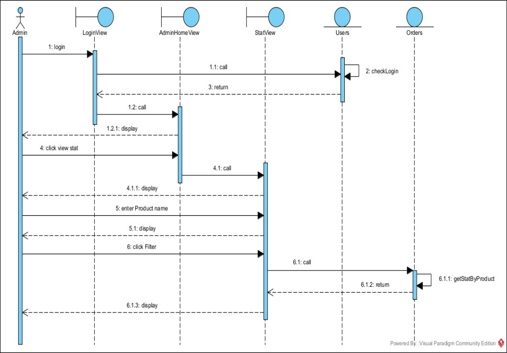

Hình: Biểu đồ tuần tự phân tích chức năng xem thống kê

# Phần 3. Pha thiết kế (131-147)

## Thiết kế lớp thực thể (Hà)

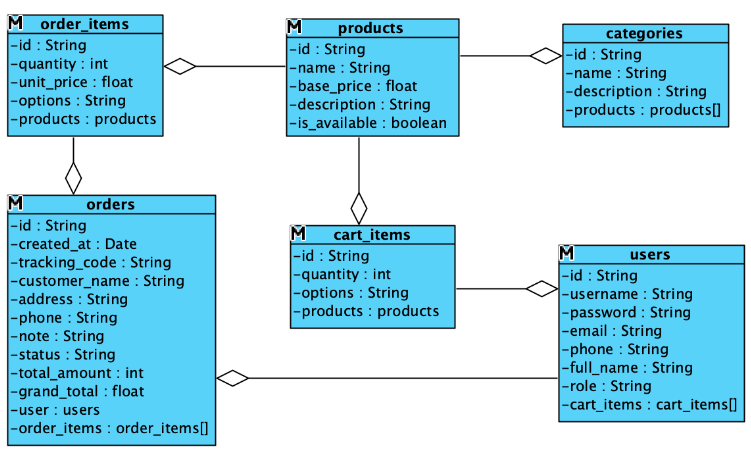

## Thiết kế cơ sở dữ liệu (Hà)

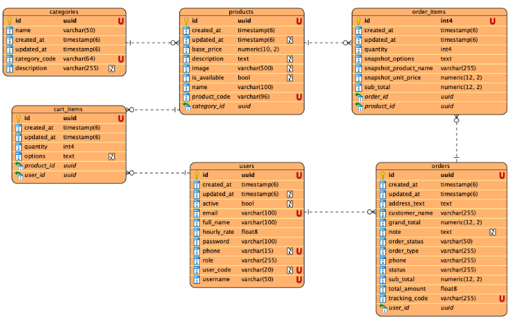

## Thiết kế chi tiết các module (Làm theo phần được giao)

1.  ***Thiết kế chi tiết cho chức năng đặt đơn hàng***

Ở bước thiết kế tĩnh, chúng ta cần các lớp theo mô hình MVC cho modul này như sau:

-   Tầng giao diện: LoginFrm là giao diện đăng nhập hệ thống. HomeFrm là giao diện chính của khách hàng. MenuFrm là giao diện xem danh sách thực đơn. ProductDetailFrm là giao diện xem chi tiết sản phẩm. CartFrm là giao diện hiển thị danh sách các món trong giỏ hàng.
-   Tầng điều khiển: user\_DAO cần để thực hiện kiểm tra thông tin đăng nhập. product\_DAO cần để thực hiện lấy danh sách sản phẩm và xem chi tiết sản phẩm. cart\_DAO cần để thực hiện thêm mặt hàng vào giỏ hàng và lấy danh sách giỏ hàng. Các lớp này đều kế thừa từ lớp DAO để điều khiển truy nhập chung vào CSDL.
-   Tầng thực thể: Cần các lớp users, products, cart\_items. Lớp cart\_items là thành phần của thực thể users, lớp products là thành phần của thực thể cart\_items.

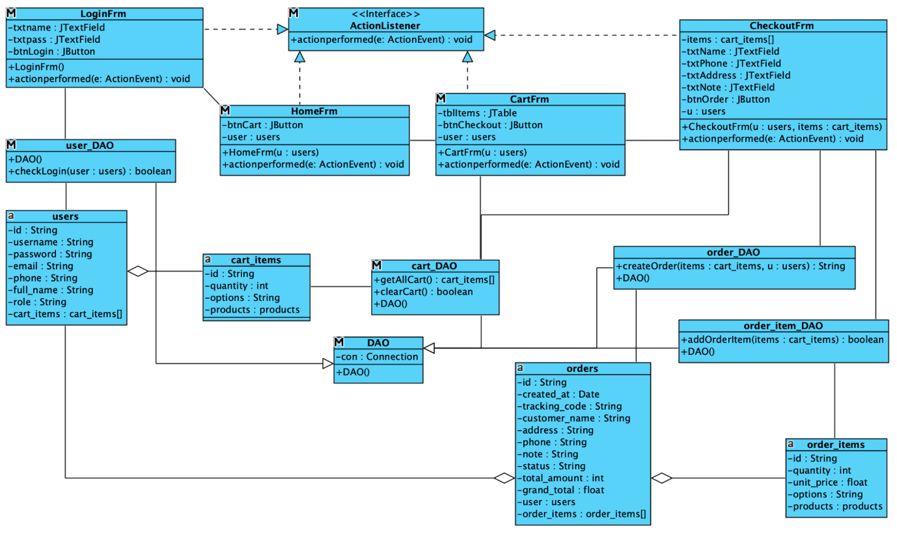

Hình: Biểu đồ lớp thiết kế chi tiết chức năng đặt đơn hàng

Đối với thiết kế động, các bước thực hiện diễn ra trong modul này như sau:

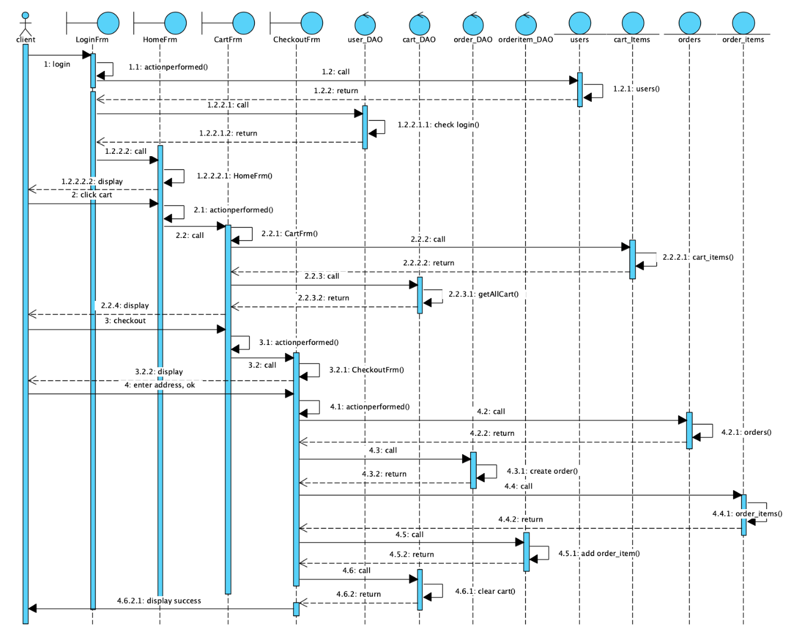

Hình: Biểu đồ tuần tự thiết kế của chức năng đặt đơn hàng

1.  Client nhập tên đăng nhập, mật khẩu và click đăng nhập trên giao diện LoginFrm.
2.  Hàm actionPerformed() của lớp LoginFrm được gọi.
3.  Hàm actionPerformed() gọi lớp users để đóng gói thông tin đăng nhập.
4.  Lớp users thực hiện đóng gói vào thực thể users.
5.  Lớp users trả đối tượng về cho phương thức actionPerformed().
6.  Phương thức actionPerformed() gọi phương thức check login() của lớp user\_DAO.
7.  Phương thức check login() kiểm tra thông tin đăng nhập.
8.  Phương thức check login() trả kết quả về cho phương thức actionPerformed().
9.  Phương thức actionPerformed() gọi lớp HomeFrm.
10.  Phương thức HomeFrm() được gọi.
11.  Giao diện tương ứng hiển thị.
12.  Client click chọn chức năng xem giỏ hàng.
13.  Phương thức actionPerformed() được kích hoạt.
14.  Phương thức actionPerformed() gọi lớp CartFrm.
15.  Phương thức CartFrm() được kích hoạt.
16.  Phương thức CartFrm() gọi lớp cart\_items để đóng gói thông tin giỏ hàng.
17.  Lớp cart\_items thực hiện đóng gói vào thực thể cart\_items.
18.  Lớp cart\_items trả đối tượng về cho phương thức CartFrm().
19.  Phương thức CartFrm() gọi phương thức getAllCart() của lớp cart\_DAO.
20.  Phương thức getAllCart() lấy danh sách giỏ hàng.
21.  Phương thức getAllCart() trả kết quả lại cho phương thức CartFrm().
22.  Giao diện tương ứng hiển thị với danh sách món trong giỏ hàng.
23.  Client click chọn chức năng thanh toán.
24.  Phương thức actionPerformed() được kích hoạt.
25.  Phương thức actionPerformed() gọi lớp CheckoutFrm.
26.  Phương thức CheckoutFrm() được kích hoạt.
27.  Giao diện tương ứng hiển thị.
28.  Client nhập địa chỉ và click ok để xác nhận đặt hàng.
29.  Phương thức actionPerformed() của lớp CheckoutFrm được kích hoạt.
30.  Phương thức actionPerformed() gọi lớp orders để đóng gói thông tin đơn hàng.
31.  Lớp orders thực hiện đóng gói vào thực thể orders.
32.  Lớp orders trả đối tượng về cho phương thức actionPerformed().
33.  Phương thức actionPerformed() gọi phương thức create order() của lớp order\_DAO.
34.  Phương thức create order() tạo đơn hàng mới.
35.  Phương thức create order() trả kết quả về cho phương thức actionPerformed().
36.  Phương thức actionPerformed() gọi lớp order\_items để đóng gói thông tin chi tiết đơn hàng.
37.  Lớp order\_items thực hiện đóng gói vào thực thể order\_items.
38.  Lớp order\_items trả đối tượng về cho phương thức actionPerformed().
39.  Phương thức actionPerformed() gọi phương thức add order\_item() của lớp orderitem\_DAO.
40.  Phương thức add order\_item() thêm chi tiết đơn hàng vào CSDL.
41.  Phương thức add order\_item() trả kết quả về cho phương thức actionPerformed().
42.  Phương thức actionPerformed() gọi phương thức clear cart() của lớp cart\_DAO.
43.  Phương thức clear cart() thực hiện xóa giỏ hàng trong CSDL.
44.  Phương thức clear cart() trả về phương thức actionPerformed().
45.  Phương thức actionPerformed() hiện thông báo thành công.
46.  ***Thiết kế chi tiết cho chức năng theo dõi đơn hàng***

Đối với thiết kế tĩnh, bỏ qua phần đăng nhập, module này cần các lớp theo ba tầng MVC như sau:

-   Tầng giao diện: LoginFrm là giao diện đăng nhập hệ thống. HomeFrm là giao diện chính của khách hàng. OrderListFrm là giao diện hiển thị danh sách đơn hàng của khách hàng. CancelConfirmFrm là giao diện xác nhận hủy đơn hàng. OrderCancelledFrm là giao diện hiển thị kết quả hủy đơn thành công.
-   Tầng điều khiển: user\_DAO cần để thực hiện kiểm tra thông tin đăng nhập. order\_DAO cần để thực hiện lấy danh sách đơn hàng theo người dùng, lấy chi tiết đơn hàng, kiểm tra trạng thái đơn hàng và hủy đơn hàng. Các lớp này đều kế thừa từ lớp DAO để điều khiển truy nhập chung vào CSDL.
-   Tầng thực thể: Cần các lớp users, orders, order\_items. Lớp order\_items là thành phần của thực thể orders.

Hình: Biểu đồ lớp thiết kế chi tiết chức năng theo dõi đơn hàng

Đối với thiết kế động, các bước thực hiện diễn ra trong modul này như sau:

1.  Client nhập tên đăng nhập, mật khẩu và click đăng nhập trên giao diện LoginFrm.
2.  Hàm actionPerformed() của lớp LoginFrm được gọi.
3.  Hàm actionPerformed() gọi lớp users để đóng gói thông tin đăng nhập.
4.  Lớp users thực hiện đóng gói vào thực thể users.
5.  Lớp users trả đối tượng về cho phương thức actionPerformed().
6.  Phương thức actionPerformed() gọi phương thức checkLogin() của lớp user\_DAO.
7.  Phương thức checkLogin() kiểm tra thông tin đăng nhập.
8.  Phương thức checkLogin() trả kết quả về cho phương thức actionPerformed().
9.  Phương thức actionPerformed() gọi lớp HomeFrm.
10.  Phương thức HomeFrm() được gọi.
11.  Giao diện tương ứng hiển thị.
12.  Client click chọn chức năng "Đơn hàng của tôi" trên giao diện HomeFrm.
13.  Hàm actionPerformed() của lớp HomeFrm được gọi.
14.  Hàm actionPerformed() gọi lớp OrderListFrm.
15.  Phương thức OrderListFrm() được kích hoạt.
16.  Phương thức OrderListFrm() gọi lớp orders để đóng gói thông tin đơn hàng.
17.  Lớp orders thực hiện đóng gói vào thực thể orders.
18.  Lớp orders trả đối tượng về cho phương thức OrderListFrm().
19.  Phương thức OrderListFrm() gọi phương thức getOrdersByUser() của lớp order\_DAO.
20.  Phương thức getOrdersByUser() lấy danh sách đơn hàng theo người dùng từ CSDL.
21.  Phương thức getOrdersByUser() trả kết quả lại cho phương thức OrderListFrm().
22.  Giao diện tương ứng hiển thị với danh sách đơn hàng. Mỗi đơn có nút "Hủy".
23.  Client click nút "Hủy" trên một đơn hàng cụ thể.
24.  Hàm actionPerformed() của lớp OrderListFrm được gọi.
25.  Hàm actionPerformed() gọi lớp CancelConfirmFrm.
26.  Phương thức CancelConfirmFrm() được kích hoạt.
27.  Phương thức CancelConfirmFrm() gọi lớp orders để lấy chi tiết đơn hàng.
28.  Lớp orders gọi phương thức getOrderDetail() của lớp order\_DAO.
29.  Phương thức getOrderDetail() trả kết quả về cho CancelConfirmFrm().
30.  Giao diện xác nhận hủy hiển thị với thông tin đơn hàng, dropdown chọn lý do hủy.
31.  Client chọn lý do hủy và click xác nhận.
32.  Hàm actionPerformed() của lớp CancelConfirmFrm được gọi.
33.  Hàm actionPerformed() gọi lớp orders để kiểm tra trạng thái.
34.  Lớp orders gọi phương thức checkOrderStatus() của lớp order\_DAO.
35.  Phương thức checkOrderStatus() trả kết quả: đơn hợp lệ để hủy.
36.  Phương thức actionPerformed() gọi phương thức cancelOrder() của lớp order\_DAO.
37.  Phương thức cancelOrder() cập nhật trạng thái đơn hàng thành "Đã hủy" trong CSDL.
38.  Phương thức cancelOrder() trả kết quả về cho phương thức actionPerformed().
39.  Phương thức actionPerformed() gọi lớp OrderCancelledFrm.
40.  Phương thức OrderCancelledFrm() được kích hoạt.
41.  Giao diện hiển thị trạng thái "Đã hủy" cùng mã đơn hàng cho client.

Hình: Biểu đồ tuần tự thiết kế của chức năng theo dõi đơn hàng

1.  ***Thiết kế chi tiết cho chức năng quản lý giỏ hàng***

Đối với thiết kế tĩnh, modul thêm đồ vào giỏ hàng cần các lớp theo ba tầng MVC như sau:

-   Tầng giao diện: LoginFrm là giao diện đăng nhập hệ thống. HomeFrm là giao diện chính của khách hàng. MenuFrm là giao diện xem danh sách thực đơn. ProductDetailFrm là giao diện xem chi tiết sản phẩm. CartFrm là giao diện hiển thị danh sách các món trong giỏ hàng.
-   Tầng điều khiển: user\_DAO cần để thực hiện kiểm tra thông tin đăng nhập. product\_DAO cần để thực hiện lấy danh sách sản phẩm và xem chi tiết sản phẩm. cart\_DAO cần để thực hiện thêm mặt hàng vào giỏ hàng và lấy danh sách giỏ hàng. Các lớp này đều kế thừa từ lớp DAO để điều khiển truy nhập chung vào CSDL.
-   Tầng thực thể: Cần các lớp users, products, cart\_items. Lớp cart\_items là thành phần của thực thể users, lớp products là thành phần của thực thể cart\_items.

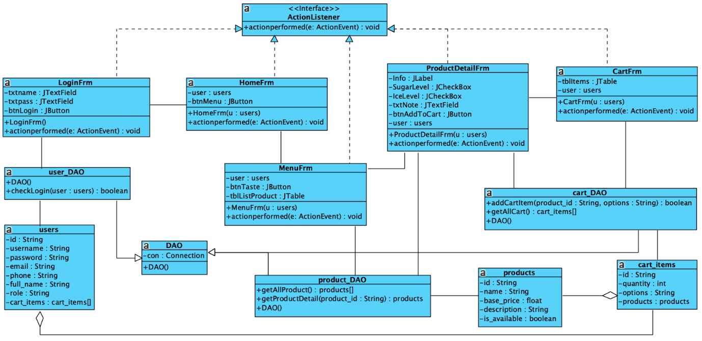

Hình: Biểu đồ lớp thiết kế chi tiết chức năng quản lý giỏ hàng

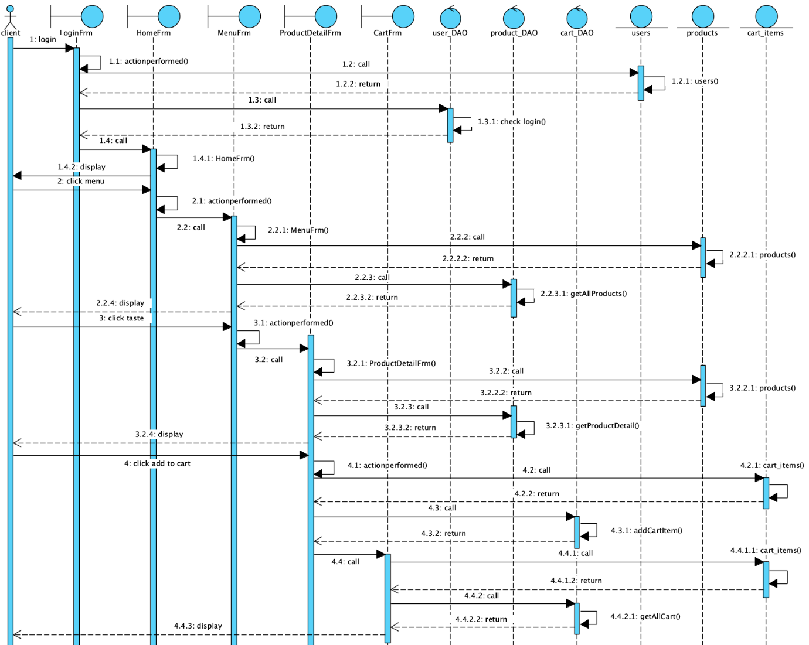

Hình: Biểu đồ tuần tự thiết kế của chức năng quản lý giỏ hàng

1.  Client nhập tên đăng nhập, mật khẩu và click đăng nhập trên giao diện LoginFrm.
2.  Hàm actionPerformed() của lớp LoginFrm được gọi.
3.  Hàm actionPerformed() gọi lớp users để đóng gói thông tin đăng nhập.
4.  Lớp users thực hiện đóng gói vào thực thể users.
5.  Lớp users trả đối tượng về cho phương thức actionPerformed().
6.  Phương thức actionPerformed() gọi phương thức check login() của lớp user\_DAO.
7.  Phương thức check login() kiểm tra thông tin đăng nhập.
8.  Phương thức check login() trả kết quả về cho phương thức actionPerformed().
9.  Phương thức actionPerformed() gọi lớp HomeFrm.
10.  Phương thức HomeFrm() được gọi.
11.  Giao diện tương ứng hiển thị.
12.  Client click chọn chức năng xem thực đơn trên giao diện HomeFrm.
13.  Hàm actionPerformed() của lớp HomeFrm được gọi.
14.  Hàm actionPerformed() gọi lớp MenuFrm.
15.  Phương thức MenuFrm() được gọi.
16.  Phương thức MenuFrm() gọi lớp products để đóng gói danh sách sản phẩm.
17.  Lớp products thực hiện đóng gói vào thực thể products.
18.  Lớp products trả đối tượng về cho phương thức MenuFrm().
19.  Phương thức MenuFrm() gọi phương thức getAllProducts() của lớp product\_DAO.
20.  Phương thức getAllProducts() lấy danh sách sản phẩm.
21.  Phương thức getAllProducts() trả kết quả lại cho phương thức MenuFrm().
22.  Giao diện tương ứng hiển thị với danh sách món ăn trong thực đơn.
23.  Client click chọn một sản phẩm cụ thể trên giao diện MenuFrm.
24.  Hàm actionPerformed() của lớp MenuFrm được gọi.
25.  Hàm actionPerformed() gọi lớp ProductDetailFrm.
26.  Phương thức ProductDetailFrm() được gọi.
27.  Phương thức ProductDetailFrm() gọi lớp products để đóng gói thông tin chi tiết sản phẩm.
28.  Lớp products thực hiện đóng gói vào thực thể products.
29.  Lớp products trả đối tượng về cho phương thức ProductDetailFrm().
30.  Phương thức ProductDetailFrm() gọi phương thức getProductDetail() của lớp product\_DAO.
31.  Phương thức getProductDetail() lấy thông tin chi tiết sản phẩm.
32.  Phương thức getProductDetail() trả kết quả lại cho phương thức ProductDetailFrm().
33.  Giao diện tương ứng hiển thị với thông tin chi tiết món và tuỳ chọn.
34.  Client click chỉnh sửa tuỳ chọn và click nút thêm vào giỏ hàng trên giao diện ProductDetailFrm.
35.  Hàm actionPerformed() của lớp ProductDetailFrm được gọi.
36.  Hàm actionPerformed() gọi lớp cart\_items để đóng gói thông tin mặt hàng cần thêm.
37.  Lớp cart\_items thực hiện đóng gói vào thực thể cart\_items.
38.  Lớp cart\_items trả đối tượng về cho phương thức actionPerformed().
39.  Phương thức actionPerformed() gọi phương thức addCartItem() của lớp cart\_DAO.
40.  Phương thức addCartItem() thêm mặt hàng vào giỏ hàng.
41.  Phương thức addCartItem() trả kết quả về cho phương thức actionPerformed().
42.  Phương thức actionPerformed() gọi lớp CartFrm.
43.  Phương thức CartFrm() được gọi.
44.  Phương thức CartFrm() gọi lớp cart\_items để đóng gói thông tin giỏ hàng.
45.  Lớp cart\_items thực hiện đóng gói vào thực thể cart\_items.
46.  Lớp cart\_items trả đối tượng về cho phương thức CartFrm().
47.  Phương thức CartFrm() gọi phương thức getAllCart() của lớp cart\_DAO.
48.  Phương thức getAllCart() lấy danh sách giỏ hàng.
49.  Phương thức getAllCart() trả kết quả lại cho phương thức CartFrm().
50.  Giao diện tương ứng hiển thị với danh sách món trong giỏ hàng bao gồm món vừa thêm.
51.  ***Thiết kế chi tiết cho chức năng quản lý sản phẩm***

Đối với thiết kế tĩnh, bỏ qua phần đăng nhập, module này cần các lớp theo ba tầng MVC như sau:

-   Tầng giao diện: LoginFrm là giao diện đăng nhập hệ thống. AdminHomeFrm là giao diện chính của admin. ManageProductFrm là giao diện hiển thị danh sách sản phẩm với ô tìm kiếm và các nút chức năng (thêm, chỉnh sửa, khóa, xóa). EditProductFrm là giao diện chỉnh sửa thông tin sản phẩm (tên, mô tả, giá, hình ảnh, danh mục, trạng thái).
-   Tầng điều khiển: user\_DAO cần để thực hiện kiểm tra thông tin đăng nhập. product\_DAO cần để thực hiện tìm kiếm sản phẩm, lấy chi tiết sản phẩm, cập nhật thông tin sản phẩm, thêm sản phẩm mới, khóa sản phẩm và xóa sản phẩm. category\_DAO cần để lấy danh sách danh mục phục vụ form chỉnh sửa sản phẩm. Các lớp này đều kế thừa từ lớp DAO để điều khiển truy nhập chung vào CSDL.
-   Tầng thực thể: Cần các lớp users, products, categories. Lớp categories là thành phần của thực thể products (mỗi sản phẩm thuộc một danh mục).

Hình: Biểu đồ lớp thiết kế chi tiết chức năng quản lý sản phẩm

Đối với thiết kế động, các bước thực hiện diễn ra trong modul này như sau:

1.  Admin nhập tên đăng nhập, mật khẩu và click đăng nhập trên giao diện LoginFrm.
2.  Hàm actionPerformed() của lớp LoginFrm được gọi.
3.  Hàm actionPerformed() gọi lớp users để đóng gói thông tin đăng nhập.
4.  Lớp users thực hiện đóng gói vào thực thể users.
5.  Lớp users trả đối tượng về cho phương thức actionPerformed().
6.  Phương thức actionPerformed() gọi phương thức checkLogin() của lớp user\_DAO.
7.  Phương thức checkLogin() kiểm tra thông tin đăng nhập.
8.  Phương thức checkLogin() trả kết quả về cho phương thức actionPerformed().
9.  Phương thức actionPerformed() gọi lớp AdminHomeFrm.
10.  Phương thức AdminHomeFrm() được gọi.
11.  Giao diện tương ứng hiển thị.
12.  Admin click chọn chức năng quản lý sản phẩm trên giao diện AdminHomeFrm.
13.  Hàm actionPerformed() của lớp AdminHomeFrm được gọi.
14.  Hàm actionPerformed() gọi lớp ManageProductFrm.
15.  Phương thức ManageProductFrm() được kích hoạt.
16.  Phương thức ManageProductFrm() gọi lớp products để đóng gói danh sách sản phẩm.
17.  Lớp products thực hiện đóng gói vào thực thể products.
18.  Lớp products trả đối tượng về cho phương thức ManageProductFrm().
19.  Phương thức ManageProductFrm() gọi phương thức getAllProducts() của lớp product\_DAO.
20.  Phương thức getAllProducts() lấy danh sách sản phẩm từ CSDL.
21.  Phương thức getAllProducts() trả kết quả lại cho phương thức ManageProductFrm().
22.  Giao diện tương ứng hiển thị với danh sách sản phẩm.
23.  Admin nhập từ khóa vào ô tìm kiếm và click nút tìm kiếm.
24.  Hàm actionPerformed() của lớp ManageProductFrm được gọi.
25.  Hàm actionPerformed() gọi phương thức searchProduct() của lớp product\_DAO.
26.  Phương thức searchProduct() tìm kiếm sản phẩm theo từ khóa từ CSDL.
27.  Phương thức searchProduct() trả kết quả lại cho phương thức actionPerformed().
28.  Giao diện ManageProductFrm hiển thị danh sách sản phẩm tìm được.
29.  Admin click vào nút "Chỉnh sửa" của một sản phẩm cụ thể.
30.  Hàm actionPerformed() của lớp ManageProductFrm được gọi.
31.  Hàm actionPerformed() gọi lớp EditProductFrm.
32.  Phương thức EditProductFrm() được kích hoạt.
33.  Phương thức EditProductFrm() gọi lớp products để đóng gói thông tin sản phẩm.
34.  Lớp products thực hiện đóng gói vào thực thể products.
35.  Lớp products trả đối tượng về cho phương thức EditProductFrm().
36.  Phương thức EditProductFrm() gọi phương thức getProductDetail() của lớp product\_DAO.
37.  Phương thức getProductDetail() lấy chi tiết sản phẩm từ CSDL.
38.  Phương thức getProductDetail() trả kết quả lại cho phương thức EditProductFrm().
39.  Phương thức EditProductFrm() gọi phương thức getAllCategories() của lớp category\_DAO để lấy danh sách danh mục.
40.  Phương thức getAllCategories() trả kết quả về cho EditProductFrm().
41.  Giao diện EditProductFrm hiển thị với thông tin sản phẩm hiện có và danh sách danh mục.
42.  Admin chỉnh sửa thông tin sản phẩm (giá, tên, mô tả, danh mục, hình ảnh) và click nút "Lưu".
43.  Hàm actionPerformed() của lớp EditProductFrm được gọi.
44.  Hàm actionPerformed() gọi lớp products để đóng gói thông tin sản phẩm đã chỉnh sửa.
45.  Lớp products thực hiện đóng gói vào thực thể products.
46.  Lớp products trả đối tượng về cho phương thức actionPerformed().
47.  Phương thức actionPerformed() gọi phương thức updateProduct() của lớp product\_DAO.
48.  Phương thức updateProduct() cập nhật thông tin sản phẩm vào CSDL.
49.  Phương thức updateProduct() trả kết quả về cho phương thức actionPerformed().
50.  Phương thức actionPerformed() hiện thông báo "Cập nhật sản phẩm thành công".
51.  Phương thức actionPerformed() gọi lại lớp ManageProductFrm.
52.  Giao diện ManageProductFrm hiển thị với sản phẩm đã được cập nhật.

Hình: Biểu đồ tuần tự thiết kế của chức năng quản lý sản phẩm

1.  ***Thiết kế chi tiết cho chức năng quản lý danh mục***

Đối với thiết kế tĩnh, bỏ qua phần đăng nhập, module này cần các lớp theo ba tầng MVC như sau:

-   Tầng giao diện: LoginFrm là giao diện đăng nhập hệ thống. AdminHomeFrm là giao diện chính của admin. ManageCategoryFrm là giao diện hiển thị danh sách danh mục với ô tìm kiếm và các nút chức năng (thêm, chỉnh sửa, xóa). AddCategoryFrm là giao diện thêm hoặc chỉnh sửa danh mục sản phẩm (tên danh mục, mô tả, trạng thái).
-   Tầng điều khiển: user\_DAO cần để thực hiện kiểm tra thông tin đăng nhập. category\_DAO cần để thực hiện lấy danh sách danh mục, thêm danh mục mới, cập nhật danh mục, xóa danh mục và tìm kiếm danh mục. Các lớp này đều kế thừa từ lớp DAO để điều khiển truy nhập chung vào CSDL.
-   Tầng thực thể: Cần các lớp users, categories.

Hình: Biểu đồ lớp thiết kế chi tiết chức năng quản lý danh mục

Đối với thiết kế động, các bước thực hiện diễn ra trong modul này như sau:

1.  Admin nhập tên đăng nhập, mật khẩu và click đăng nhập trên giao diện LoginFrm.
2.  Hàm actionPerformed() của lớp LoginFrm được gọi.
3.  Hàm actionPerformed() gọi lớp users để đóng gói thông tin đăng nhập.
4.  Lớp users thực hiện đóng gói vào thực thể users.
5.  Lớp users trả đối tượng về cho phương thức actionPerformed().
6.  Phương thức actionPerformed() gọi phương thức checkLogin() của lớp user\_DAO.
7.  Phương thức checkLogin() kiểm tra thông tin đăng nhập.
8.  Phương thức checkLogin() trả kết quả về cho phương thức actionPerformed().
9.  Phương thức actionPerformed() gọi lớp AdminHomeFrm.
10.  Phương thức AdminHomeFrm() được gọi.
11.  Giao diện tương ứng hiển thị.
12.  Admin click chọn chức năng quản lý danh mục trên giao diện AdminHomeFrm.
13.  Hàm actionPerformed() của lớp AdminHomeFrm được gọi.
14.  Hàm actionPerformed() gọi lớp ManageCategoryFrm.
15.  Phương thức ManageCategoryFrm() được kích hoạt.
16.  Phương thức ManageCategoryFrm() gọi lớp categories để đóng gói danh sách danh mục.
17.  Lớp categories thực hiện đóng gói vào thực thể categories.
18.  Lớp categories trả đối tượng về cho phương thức ManageCategoryFrm().
19.  Phương thức ManageCategoryFrm() gọi phương thức getAllCategories() của lớp category\_DAO.
20.  Phương thức getAllCategories() lấy danh sách danh mục từ CSDL.
21.  Phương thức getAllCategories() trả kết quả lại cho phương thức ManageCategoryFrm().
22.  Giao diện tương ứng hiển thị với danh sách danh mục.
23.  Admin click vào nút "Thêm danh mục".
24.  Hàm actionPerformed() của lớp ManageCategoryFrm được gọi.
25.  Hàm actionPerformed() gọi lớp AddCategoryFrm.
26.  Phương thức AddCategoryFrm() được kích hoạt.
27.  Giao diện AddCategoryFrm hiển thị với form nhập thông tin danh mục.
28.  Admin điền tên danh mục, mô tả và click nút "Lưu".
29.  Hàm actionPerformed() của lớp AddCategoryFrm được gọi.
30.  Hàm actionPerformed() gọi lớp categories để đóng gói thông tin danh mục mới.
31.  Lớp categories thực hiện đóng gói vào thực thể categories.
32.  Lớp categories trả đối tượng về cho phương thức actionPerformed().
33.  Phương thức actionPerformed() gọi phương thức addCategory() của lớp category\_DAO.
34.  Phương thức addCategory() kiểm tra tính hợp lệ: tên không được để trống, không trùng danh mục đã có.
35.  Phương thức addCategory() thêm danh mục mới vào CSDL.
36.  Phương thức addCategory() trả kết quả về cho phương thức actionPerformed().
37.  Phương thức actionPerformed() hiện thông báo "Thêm danh mục thành công".
38.  Phương thức actionPerformed() gọi lại lớp ManageCategoryFrm.
39.  Giao diện ManageCategoryFrm hiển thị với danh mục mới được thêm.

Hình: Biểu đồ tuần tự thiết kế của chức năng quản lý danh mục

1.  ***Thiết kế chi tiết cho chức năng xem chi tiết ( quản lý đơn hàng)***

Đối với thiết kế tĩnh, bỏ qua phần đăng nhập, module này cần các lớp theo ba tầng MVC như sau:

-   Tầng giao diện: LoginFrm là giao diện đăng nhập hệ thống. AdminHomeFrm là giao diện chính của admin. OrderManagementFrm là giao diện hiển thị danh sách các đơn hàng. OrderDetailFrm là giao diện xem chi tiết một đơn hàng cụ thể.
-   Tầng điều khiển: user\_DAO cần để thực hiện kiểm tra thông tin đăng nhập. order\_DAO cần để thực hiện lấy danh sách đơn hàng và xem chi tiết đơn hàng. Các lớp này đều kế thừa từ lớp DAO để điều khiển truy nhập chung vào CSDL.
-   Tầng thực thể: Cần các lớp users, orders, order\_items. Lớp order\_items là thành phần của thực thể orders, lớp users là thành phần của thực thể orders.

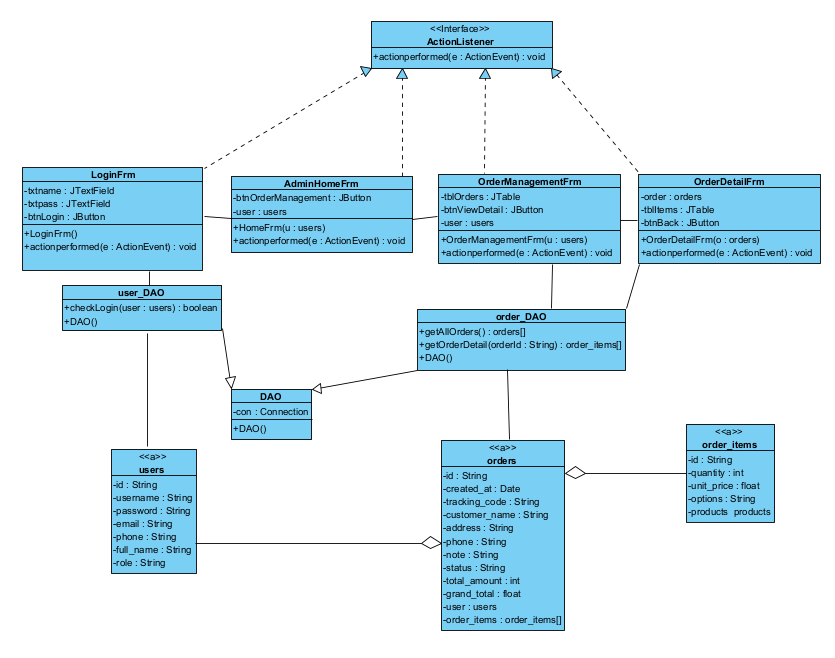

Hình: Biểu đồ lớp thiết kế chi tiết chức năng quản lý đơn hàng

Đối với thiết kế động, các bước thực hiện diễn ra trong modul này như sau:

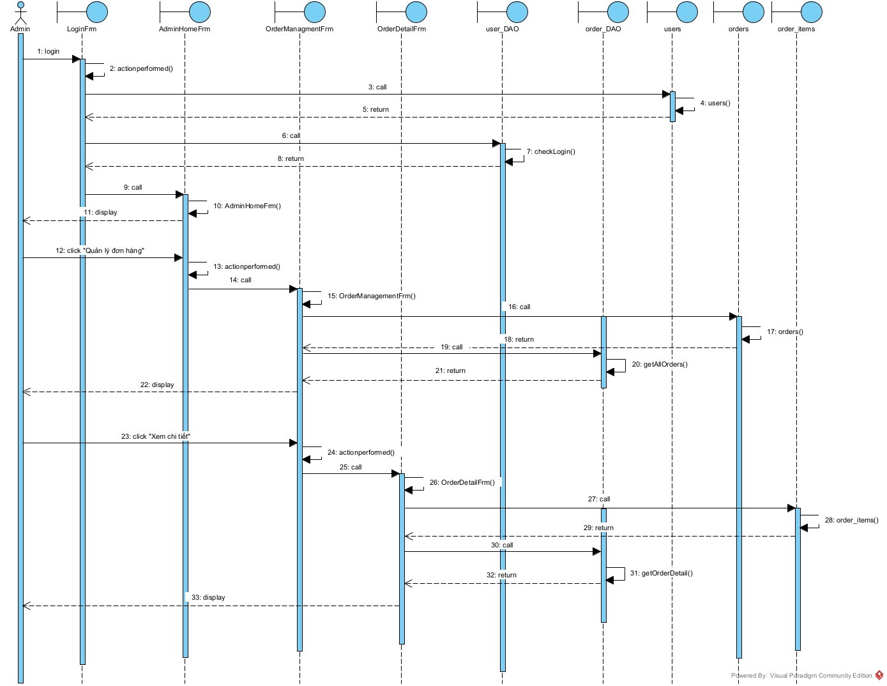

Hình: Biểu đồ tuần tự thiết kế của chức năng xem chi tiết đơn hàng

1.  Admin nhập tên đăng nhập, mật khẩu và click đăng nhập trên giao diện LoginFrm.
2.  Hàm actionPerformed() của lớp LoginFrm được gọi.
3.  Hàm actionPerformed() gọi lớp users để đóng gói thông tin đăng nhập.
4.  Lớp users thực hiện đóng gói vào thực thể users.
5.  Lớp users trả đối tượng về cho phương thức actionPerformed().
6.  Phương thức actionPerformed() gọi phương thức checkLogin() của lớp user\_DAO.
7.  Phương thức checkLogin() kiểm tra thông tin đăng nhập.
8.  Phương thức checkLogin() trả kết quả về cho phương thức actionPerformed().
9.  Phương thức actionPerformed() gọi lớp AdminHomeFrm.
10.  Phương thức AdminHomeFrm() được gọi.
11.  Giao diện tương ứng hiển thị.
12.  Admin click chọn chức năng quản lý đơn hàng.
13.  Phương thức actionPerformed() được kích hoạt.
14.  Phương thức actionPerformed() gọi lớp OrderManagementFrm.
15.  Phương thức OrderManagementFrm() được kích hoạt.
16.  Phương thức OrderManagementFrm() gọi lớp orders để đóng gói thông tin đơn hàng.
17.  Lớp orders thực hiện đóng gói vào thực thể orders.
18.  Lớp orders trả đối tượng về cho phương thức OrderManagementFrm().
19.  Phương thức OrderManagementFrm() gọi phương thức getAllOrders() của lớp order\_DAO.
20.  Phương thức getAllOrders() lấy danh sách đơn hàng từ CSDL.
21.  Phương thức getAllOrders() trả kết quả lại cho phương thức OrderManagementFrm().
22.  Giao diện tương ứng hiển thị với danh sách đơn hàng.
23.  Admin click chọn xem chi tiết một đơn hàng.
24.  Phương thức actionPerformed() được kích hoạt.
25.  Phương thức actionPerformed() gọi lớp OrderDetailFrm.
26.  Phương thức OrderDetailFrm() được kích hoạt.
27.  Phương thức OrderDetailFrm() gọi lớp order\_items để đóng gói thông tin chi tiết.
28.  Lớp order\_items thực hiện đóng gói vào thực thể order\_items.
29.  Lớp order\_items trả đối tượng về cho phương thức OrderDetailFrm().
30.  Phương thức OrderDetailFrm() gọi phương thức getOrderDetail(orderId) của lớp order\_DAO.
31.  Phương thức getOrderDetail() lấy chi tiết đơn hàng từ CSDL.
32.  Phương thức getOrderDetail() trả kết quả lại cho phương thức OrderDetailFrm().
33.  Giao diện chi tiết đơn hàng hiển thị đầy đủ thông tin cho admin.
34.  ***Thiết kế chi tiết cho chức năng xem thống kê***

Đối với thiết kế tĩnh, bỏ qua phần đăng nhập, module này cần các lớp theo ba tầng MVC như sau:

-   Tầng giao diện: LoginFrm là giao diện đăng nhập hệ thống. AdminHomeFrm là giao diện chính của admin. StatFrm là giao diện hiển thị thống kê doanh thu với bộ lọc theo thời gian và theo sản phẩm, bao gồm bảng thống kê và biểu đồ.
-   Tầng điều khiển: user\_DAO cần để thực hiện kiểm tra thông tin đăng nhập. order\_DAO cần để thực hiện truy vấn thống kê doanh thu theo sản phẩm và theo thời gian. Các lớp này đều kế thừa từ lớp DAO để điều khiển truy nhập chung vào CSDL.
-   Tầng thực thể: Cần các lớp users, orders, order\_items, products.

Hình: Biểu đồ lớp thiết kế chi tiết chức năng xem thống kê

Đối với thiết kế động, các bước thực hiện diễn ra trong modul này như sau:

1.  Admin nhập tên đăng nhập, mật khẩu và click đăng nhập trên giao diện LoginFrm.
2.  Hàm actionPerformed() của lớp LoginFrm được gọi.
3.  Hàm actionPerformed() gọi lớp users để đóng gói thông tin đăng nhập.
4.  Lớp users thực hiện đóng gói vào thực thể users.
5.  Lớp users trả đối tượng về cho phương thức actionPerformed().
6.  Phương thức actionPerformed() gọi phương thức checkLogin() của lớp user\_DAO.
7.  Phương thức checkLogin() kiểm tra thông tin đăng nhập.
8.  Phương thức checkLogin() trả kết quả về cho phương thức actionPerformed().
9.  Phương thức actionPerformed() gọi lớp AdminHomeFrm.
10.  Phương thức AdminHomeFrm() được gọi.
11.  Giao diện tương ứng hiển thị.
12.  Admin click chọn chức năng xem thống kê trên giao diện AdminHomeFrm.
13.  Hàm actionPerformed() của lớp AdminHomeFrm được gọi.
14.  Hàm actionPerformed() gọi lớp StatFrm.
15.  Phương thức StatFrm() được kích hoạt.
16.  Phương thức StatFrm() gọi lớp orders để đóng gói thông tin thống kê.
17.  Lớp orders thực hiện đóng gói vào thực thể orders.
18.  Lớp orders trả đối tượng về cho phương thức StatFrm().
19.  Phương thức StatFrm() gọi phương thức getMonthlyRevenue() của lớp order\_DAO.
20.  Phương thức getMonthlyRevenue() lấy dữ liệu doanh thu theo tháng từ CSDL.
21.  Phương thức getMonthlyRevenue() trả kết quả lại cho phương thức StatFrm().
22.  Giao diện StatFrm hiển thị tổng doanh thu và biểu đồ theo tháng cho admin.
23.  Admin nhập tên sản phẩm vào ô ProductName và click nút "Filter".
24.  Hàm actionPerformed() của lớp StatFrm được gọi.
25.  Hàm actionPerformed() gọi lớp orders để đóng gói thông tin lọc.
26.  Lớp orders thực hiện đóng gói vào thực thể orders.
27.  Lớp orders trả đối tượng về cho phương thức actionPerformed().
28.  Phương thức actionPerformed() gọi phương thức getStatByProduct() của lớp order\_DAO.
29.  Phương thức getStatByProduct() truy vấn dữ liệu thống kê theo sản phẩm từ CSDL.
30.  Phương thức getStatByProduct() trả kết quả về cho phương thức actionPerformed().
31.  Giao diện StatFrm hiển thị thông tin sản phẩm và tổng doanh thu của sản phẩm cho admin.

Hình: Biểu đồ tuần tự thiết kế của chức năng xem thống kê